# GifLab metrics audit

Three-phase audit: (1) sanity tests on synthetic content, (2) lossy calibration pilot, (3) corpus sweep at the chosen lossy levels. Findings are advisory — the goal is to surface anything weird in metric behaviour, not to ship fixes.

## Known interpretation caveats

- **smooth_gradient SSIM "bump-up" at strong lossy is benign.** Several SSIM/PSNR/MSE aggregates flagged as SUSPICIOUS on the `lossy` monotonicity test against `smooth_gradient` (e.g. `ssim_min` = `[0.9932, 0.8445, 0.8240, 0.8286]` across lossy levels `[20, 60, 100, 160]`) are an artefact of animately's internal saturation on low-complexity content, not a metric bug. The compressed output stabilises to bit-identical bytes by lossy ≈ 125; the audit grid samples two distinct outputs straddling that saturation knee, and the latter happens to score marginally better on local-window similarity. Confirmed by direct raw per-frame SSIM (no clamp, no aggregation). The SSIM clamp in `src/giflab/metrics.py` is a defensive [0, 1] guard and is not the cause. See `scripts/audit/sanity.py:LOSSY_LEVELS` and the docstring on `calculate_safe_psnr` / `calculate_ms_ssim` for the in-code reference notes.

- **`texture_similarity` ≈ 1.0 while `ssim`/`deltae`/`ssimulacra2` collapse is DIAGNOSTIC, not anomalous.** `texture_similarity` is computed on a greyscale LBP histogram and is colour-blind — it measures coarse spatial micro-texture, not colour fidelity. On a pure colour-quantisation failure (palette reorganised, luminance pattern preserved) it stays near 1.0 while every colour/luminance metric collapses. The 2026-05-26 outlier deep-dive saw this on two real GIFs — `8e172835` (Christmas stocking) and `XpkfMAWfUsWgNN` (gstatic data-viz): `texture_similarity ≈ 0.999` alongside `ssim` 0.11-0.23, `deltae` 25-66, `ssimulacra2` 0. Read the divergence as a "structure-preserved / colour-destroyed" separator, not a metric bug. **Weight-audit verdict:** `texture_similarity` carries only `ENHANCED_TEXTURE_WEIGHT` (0.03) in `composite_quality`, so a surviving texture score cannot lift a catastrophic-colour-failure composite over an acceptance threshold — both outliers scored `composite_quality` 0.41 / 0.24 despite `texture_similarity ≈ 0.999`. The current weighting is NOT a false-acceptance risk; future weighting changes must preserve this bound. See `docs/metrics-audit/outlier-deep-dive-2026-05-26.md`, the `texture_similarity` docstring in `src/giflab/metrics.py`, and the regression guard `tests/functional/test_single_stream_metric_clarity.py::TestTextureSimilarityCannotMaskColourFailure`.

## Phase 2 — pilot calibration

**Chosen lossy levels for the main sweep:** `[20, 40, 60]`

Rationale:
- lossy=20 maximises cross-metric disagreement (score 1.000)
- lossy=40 also high disagreement (score 1.000, 1.00x of peak)
- lossy=60 also high disagreement (score 1.000, 1.00x of peak)

**Cross-metric disagreement by lossy level:**

| lossy | disagreement |
|---|---|
| 0 | 0.952 |
| 20 | 1.000 |
| 40 | 1.000 |
| 60 | 1.000 |
| 80 | 1.000 |
| 100 | 1.000 |
| 140 | 1.000 |
| 200 | 1.000 |

**Response curves (one line per pilot GIF):**

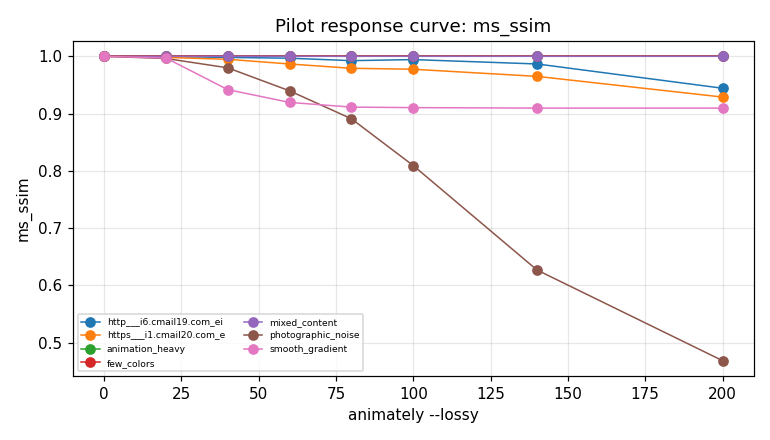

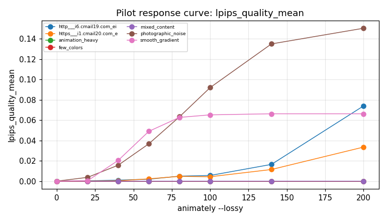

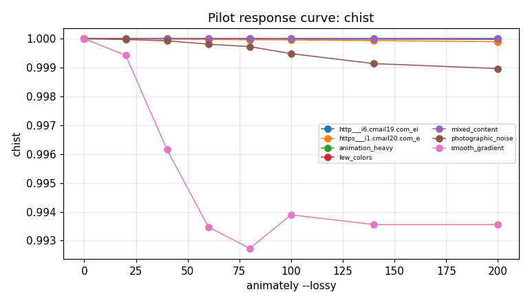

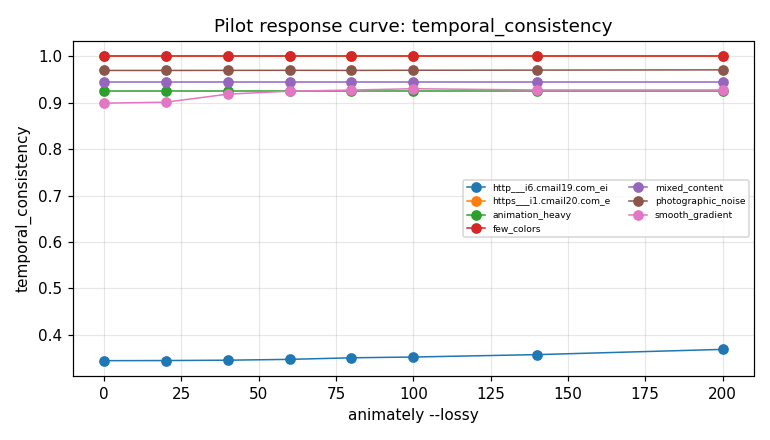

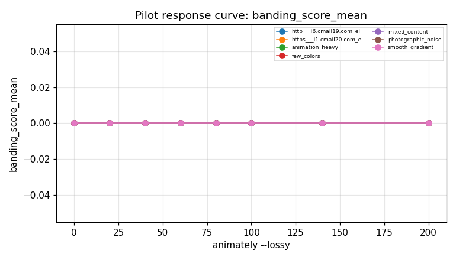

## Phase 1 — sanity verdicts

Identity = metric on (gif, gif). Pathological = metric on (white, black). Direction inferred from those two reference points. Verdict PASS if monotonicity holds across all degradation kinds (noise / blur / quantize / animately lossy). SUSPICIOUS if any kind shows an inversion. INCONCLUSIVE if identity == pathological (usually a single-stream metric where this pair can't discriminate).

| metric | identity_mean | pathological | direction | verdict | note |
|---|---|---|---|---|---|
| alignment_accuracy | 1.0000 | 1.0000 | flat | INCONCLUSIVE | identity and both pathological pairs (solid + structural) gave identical values — metric doesn't discriminate even on (gradient vs inverse) |
| banding_patch_count | 0.0000 | 0.0000 | flat | INCONCLUSIVE | identity and both pathological pairs (solid + structural) gave identical values — metric doesn't discriminate even on (gradient vs inverse) |
| banding_score_mean | 0.0000 | 0.0000 | flat | INCONCLUSIVE | identity and both pathological pairs (solid + structural) gave identical values — metric doesn't discriminate even on (gradient vs inverse) |
| banding_score_p95 | 0.0000 | 0.0000 | flat | INCONCLUSIVE | identity and both pathological pairs (solid + structural) gave identical values — metric doesn't discriminate even on (gradient vs inverse) |
| chist | 1.0000 | 0.3414 | higher_better | SUSPICIOUS | 4 monotonicity violation(s); patho=structural |
| chist_first | 1.0000 | 0.1713 | higher_better | SUSPICIOUS | 6 monotonicity violation(s); patho=structural |
| chist_last | 1.0000 | 0.3062 | higher_better | SUSPICIOUS | 3 monotonicity violation(s); patho=structural |
| chist_max | 1.0000 | 0.4839 | higher_better | SUSPICIOUS | 3 monotonicity violation(s); patho=solid |
| chist_middle | 1.0000 | 0.1713 | higher_better | SUSPICIOUS | 3 monotonicity violation(s); patho=structural |
| chist_min | 1.0000 | 0.1713 | higher_better | SUSPICIOUS | 3 monotonicity violation(s); patho=structural |
| chist_positional_variance | 0.0000 | 0.0040 | lower_better | SUSPICIOUS | 5 monotonicity violation(s); patho=structural |
| chist_std | 0.0000 | 0.1249 | lower_better | SUSPICIOUS | 6 monotonicity violation(s); patho=structural |
| color_count_compressed | 103.2750 | 251.3750 | lower_better | SUSPICIOUS | 6 monotonicity violation(s); patho=structural |
| color_count_original | 103.2750 | 251.3750 | lower_better | PASS | patho=structural |
| color_patch_count | 11.6000 | 1.0000 | higher_better | PASS | patho=solid |
| composite_quality | 0.9903 | 0.5606 | higher_better | PASS | patho=structural |
| compressed_frame_count | 6.8000 | 1.0000 | higher_better | PASS | patho=solid |
| compression_ratio | 1.0000 | 1.0000 | flat | INCONCLUSIVE | identity and both pathological pairs (solid + structural) gave identical values — metric doesn't discriminate even on (gradient vs inverse) |
| deep_perceptual_downscaled | 0.0000 | 0.0000 | flat | INCONCLUSIVE | identity and both pathological pairs (solid + structural) gave identical values — metric doesn't discriminate even on (gradient vs inverse) |
| deep_perceptual_frame_count | 6.8000 | 1.0000 | higher_better | PASS | patho=solid |
| deltae_max | 0.0000 | 100.0000 | lower_better | PASS | patho=solid |
| deltae_mean | 0.0000 | 100.0000 | lower_better | PASS | patho=solid |
| deltae_p95 | 0.0000 | 100.0000 | lower_better | PASS | patho=solid |
| deltae_pct_gt1 | 0.0000 | 100.0000 | lower_better | PASS | patho=solid |
| deltae_pct_gt2 | 0.0000 | 100.0000 | lower_better | SUSPICIOUS | 1 monotonicity violation(s); patho=solid |
| deltae_pct_gt3 | 0.0000 | 100.0000 | lower_better | PASS | patho=solid |
| deltae_pct_gt5 | 0.0000 | 100.0000 | lower_better | PASS | patho=solid |
| disposal_artifacts | 0.8202 | 1.0000 | lower_better | SUSPICIOUS | 12 monotonicity violation(s); patho=solid |
| disposal_artifacts_delta | 0.0000 | 0.2161 | lower_better | SUSPICIOUS | 8 monotonicity violation(s); patho=structural |
| disposal_artifacts_max | 0.8202 | 1.0000 | lower_better | SUSPICIOUS | 12 monotonicity violation(s); patho=solid |
| disposal_artifacts_min | 0.8202 | 1.0000 | lower_better | SUSPICIOUS | 12 monotonicity violation(s); patho=solid |
| disposal_artifacts_post | 0.8202 | 1.0000 | lower_better | SUSPICIOUS | 12 monotonicity violation(s); patho=solid |
| disposal_artifacts_pre | 0.8202 | 1.0000 | lower_better | PASS | patho=solid |
| disposal_artifacts_std | 0.0000 | 0.0000 | flat | INCONCLUSIVE | identity and both pathological pairs (solid + structural) gave identical values — metric doesn't discriminate even on (gradient vs inverse) |
| dither_quality_score | 0.0000 | 0.0000 | flat | INCONCLUSIVE | identity and both pathological pairs (solid + structural) gave identical values — metric doesn't discriminate even on (gradient vs inverse) |
| dither_ratio_mean | 0.0000 | 0.0000 | flat | INCONCLUSIVE | identity and both pathological pairs (solid + structural) gave identical values — metric doesn't discriminate even on (gradient vs inverse) |
| dither_ratio_p95 | 0.0000 | 0.0000 | flat | INCONCLUSIVE | identity and both pathological pairs (solid + structural) gave identical values — metric doesn't discriminate even on (gradient vs inverse) |
| duration_diff_ms | 0.0000 | 0.0000 | flat | INCONCLUSIVE | identity and both pathological pairs (solid + structural) gave identical values — metric doesn't discriminate even on (gradient vs inverse) |
| edge_similarity | 1.0000 | 0.7500 | higher_better | SUSPICIOUS | 3 monotonicity violation(s); patho=structural |
| edge_similarity_max | 1.0000 | 1.0000 | flat | INCONCLUSIVE | identity and both pathological pairs (solid + structural) gave identical values — metric doesn't discriminate even on (gradient vs inverse) |
| edge_similarity_min | 1.0000 | 0.0000 | higher_better | PASS | patho=structural |
| edge_similarity_std | 0.0000 | 0.4330 | lower_better | SUSPICIOUS | 12 monotonicity violation(s); patho=structural |
| efficiency | 0.4748 | 0.3573 | higher_better | SUSPICIOUS | 5 monotonicity violation(s); patho=structural |
| flat_flicker_ratio | 0.2216 | 0.0000 | higher_better | SUSPICIOUS | 3 monotonicity violation(s); patho=solid |
| flat_region_count | 0.0000 | 1.0000 | lower_better | PASS | patho=solid |
| flicker_excess | 0.1756 | 0.0000 | higher_better | SUSPICIOUS | 10 monotonicity violation(s); patho=solid |
| flicker_frame_ratio | 1.0000 | 0.0000 | higher_better | SUSPICIOUS | 1 monotonicity violation(s); patho=solid |
| frame_count | 6.8000 | 1.0000 | higher_better | PASS | patho=solid |
| fsim | 1.0000 | 0.7051 | higher_better | SUSPICIOUS | 1 monotonicity violation(s); patho=structural |
| fsim_first | 1.0000 | 0.7265 | higher_better | SUSPICIOUS | 1 monotonicity violation(s); patho=structural |
| fsim_last | 1.0000 | 0.6811 | higher_better | SUSPICIOUS | 2 monotonicity violation(s); patho=structural |
| fsim_max | 1.0000 | 0.7265 | higher_better | SUSPICIOUS | 2 monotonicity violation(s); patho=structural |
| fsim_middle | 1.0000 | 0.7265 | higher_better | SUSPICIOUS | 1 monotonicity violation(s); patho=structural |
| fsim_min | 1.0000 | 0.6811 | higher_better | SUSPICIOUS | 1 monotonicity violation(s); patho=structural |
| fsim_positional_variance | 0.0000 | 0.0005 | flat | INCONCLUSIVE | identity and both pathological pairs (solid + structural) gave identical values — metric doesn't discriminate even on (gradient vs inverse) |
| fsim_std | 0.0000 | 0.0202 | lower_better | SUSPICIOUS | 8 monotonicity violation(s); patho=structural |
| gmsd | 0.0000 | 0.3852 | lower_better | SUSPICIOUS | 8 monotonicity violation(s); patho=structural |
| gmsd_max | 0.0000 | 0.3987 | lower_better | SUSPICIOUS | 8 monotonicity violation(s); patho=structural |
| gmsd_min | 0.0000 | 0.3712 | lower_better | SUSPICIOUS | 8 monotonicity violation(s); patho=structural |
| gmsd_std | 0.0000 | 0.0130 | lower_better | SUSPICIOUS | 11 monotonicity violation(s); patho=structural |
| gradient_region_count | 0.0000 | 0.0000 | flat | INCONCLUSIVE | identity and both pathological pairs (solid + structural) gave identical values — metric doesn't discriminate even on (gradient vs inverse) |
| grid_length | 80.0000 | 10.0000 | higher_better | PASS | patho=solid |
| has_text_ui_content | 0.4000 | 0.0000 | higher_better | PASS | patho=solid |
| kilobytes | 55.2578 | 0.2168 | higher_better | SUSPICIOUS | 9 monotonicity violation(s); patho=solid |
| lpips_quality_max | 0.0000 | 0.8052 | lower_better | SUSPICIOUS | 1 monotonicity violation(s); patho=solid |
| lpips_quality_mean | 0.0000 | 0.8052 | lower_better | PASS | patho=solid |
| lpips_quality_p95 | 0.0000 | 0.8052 | lower_better | SUSPICIOUS | 1 monotonicity violation(s); patho=solid |
| lpips_t_mean | 0.1956 | 0.0000 | higher_better | SUSPICIOUS | 10 monotonicity violation(s); patho=solid |
| lpips_t_p95 | 0.2258 | 0.0000 | higher_better | SUSPICIOUS | 11 monotonicity violation(s); patho=solid |
| max_timing_drift_ms | 0.0000 | 0.0000 | flat | INCONCLUSIVE | identity and both pathological pairs (solid + structural) gave identical values — metric doesn't discriminate even on (gradient vs inverse) |
| ms_ssim | 1.0000 | -0.0549 | higher_better | PASS | patho=structural |
| ms_ssim_max | 1.0000 | -0.0295 | higher_better | SUSPICIOUS | 1 monotonicity violation(s); patho=structural |
| ms_ssim_min | 1.0000 | -0.0764 | higher_better | SUSPICIOUS | 1 monotonicity violation(s); patho=structural |
| ms_ssim_std | 0.0000 | 0.0171 | lower_better | SUSPICIOUS | 5 monotonicity violation(s); patho=structural |
| mse | 0.0000 | 65025.0000 | lower_better | PASS | patho=solid |
| mse_first | 0.0000 | 65025.0000 | lower_better | PASS | patho=solid |
| mse_last | 0.0000 | 65025.0000 | lower_better | SUSPICIOUS | 1 monotonicity violation(s); patho=solid |
| mse_max | 0.0000 | 65025.0000 | lower_better | SUSPICIOUS | 1 monotonicity violation(s); patho=solid |
| mse_middle | 0.0000 | 65025.0000 | lower_better | PASS | patho=solid |
| mse_min | 0.0000 | 65025.0000 | lower_better | PASS | patho=solid |
| mse_positional_variance | 0.0000 | 10.7677 | lower_better | SUSPICIOUS | 5 monotonicity violation(s); patho=structural |
| mse_std | 0.0000 | 4.8306 | lower_better | SUSPICIOUS | 5 monotonicity violation(s); patho=structural |
| ocr_regions_analyzed | 0.0000 | nan | lower_better | PASS | patho=solid |
| palette_distance | 0.0000 | 441.6730 | lower_better | SUSPICIOUS | 1 monotonicity violation(s); patho=solid |
| posterization_score | 0.0000 | 0.0000 | flat | INCONCLUSIVE | identity and both pathological pairs (solid + structural) gave identical values — metric doesn't discriminate even on (gradient vs inverse) |
| psnr | 1.0000 | 0.0000 | higher_better | PASS | patho=solid |
| psnr_max | 1.0000 | 0.0000 | higher_better | PASS | patho=solid |
| psnr_min | 1.0000 | 0.0000 | higher_better | SUSPICIOUS | 1 monotonicity violation(s); patho=solid |
| psnr_std | 0.0000 | 0.0000 | flat | INCONCLUSIVE | identity and both pathological pairs (solid + structural) gave identical values — metric doesn't discriminate even on (gradient vs inverse) |
| quality_oscillation_frequency | 0.4857 | 0.0000 | higher_better | SUSPICIOUS | 7 monotonicity violation(s); patho=solid |
| render_ms | 4072.6000 | 177.0000 | higher_better | SUSPICIOUS | 19 monotonicity violation(s); patho=solid |
| rmse | 0.0000 | 255.0000 | lower_better | PASS | patho=solid |
| rmse_max | 0.0000 | 255.0000 | lower_better | SUSPICIOUS | 1 monotonicity violation(s); patho=solid |
| rmse_min | 0.0000 | 255.0000 | lower_better | PASS | patho=solid |
| rmse_std | 0.0000 | 0.0190 | lower_better | SUSPICIOUS | 7 monotonicity violation(s); patho=structural |
| sharpness_similarity | 1.0000 | 0.8366 | higher_better | SUSPICIOUS | 2 monotonicity violation(s); patho=structural |
| sharpness_similarity_max | 1.0000 | 0.9599 | higher_better | SUSPICIOUS | 4 monotonicity violation(s); patho=structural |
| sharpness_similarity_min | 1.0000 | 0.7261 | higher_better | SUSPICIOUS | 2 monotonicity violation(s); patho=structural |
| sharpness_similarity_std | 0.0000 | 0.0882 | lower_better | SUSPICIOUS | 11 monotonicity violation(s); patho=structural |
| ssim | 1.0000 | 0.0001 | higher_better | SUSPICIOUS | 2 monotonicity violation(s); patho=solid |
| ssim_first | 1.0000 | 0.0001 | higher_better | SUSPICIOUS | 1 monotonicity violation(s); patho=solid |
| ssim_last | 1.0000 | 0.0001 | higher_better | SUSPICIOUS | 2 monotonicity violation(s); patho=solid |
| ssim_max | 1.0000 | 0.0001 | higher_better | SUSPICIOUS | 1 monotonicity violation(s); patho=solid |
| ssim_middle | 1.0000 | 0.0001 | higher_better | SUSPICIOUS | 1 monotonicity violation(s); patho=solid |
| ssim_min | 1.0000 | 0.0001 | higher_better | SUSPICIOUS | 2 monotonicity violation(s); patho=solid |
| ssim_positional_variance | 0.0000 | 0.0000 | flat | INCONCLUSIVE | identity and both pathological pairs (solid + structural) gave identical values — metric doesn't discriminate even on (gradient vs inverse) |
| ssim_std | 0.0000 | 0.0099 | lower_better | SUSPICIOUS | 9 monotonicity violation(s); patho=structural |
| ssimulacra2_frame_count | 6.8000 | 1.0000 | higher_better | PASS | patho=solid |
| ssimulacra2_mean | 1.0000 | 0.0000 | higher_better | PASS | patho=solid |
| ssimulacra2_min | 1.0000 | 0.0000 | higher_better | PASS | patho=solid |
| ssimulacra2_p95 | 1.0000 | 0.0000 | higher_better | PASS | patho=solid |
| ssimulacra2_triggered | 1.0000 | 1.0000 | flat | INCONCLUSIVE | identity and both pathological pairs (solid + structural) gave identical values — metric doesn't discriminate even on (gradient vs inverse) |
| temporal_consistency | 0.9737 | 0.8991 | higher_better | SUSPICIOUS | 7 monotonicity violation(s); patho=structural |
| temporal_consistency_delta | 0.0000 | 0.0000 | flat | INCONCLUSIVE | identity and both pathological pairs (solid + structural) gave identical values — metric doesn't discriminate even on (gradient vs inverse) |
| temporal_consistency_max | 0.9737 | 0.8991 | higher_better | SUSPICIOUS | 7 monotonicity violation(s); patho=structural |
| temporal_consistency_min | 0.9737 | 0.8991 | higher_better | SUSPICIOUS | 7 monotonicity violation(s); patho=structural |
| temporal_consistency_post | 0.9737 | 0.8991 | higher_better | SUSPICIOUS | 7 monotonicity violation(s); patho=structural |
| temporal_consistency_pre | 0.9737 | 0.8991 | higher_better | PASS | patho=structural |
| temporal_consistency_std | 0.0000 | 0.0000 | flat | INCONCLUSIVE | identity and both pathological pairs (solid + structural) gave identical values — metric doesn't discriminate even on (gradient vs inverse) |
| temporal_pumping_score | 0.0013 | 0.0000 | higher_better | SUSPICIOUS | 10 monotonicity violation(s); patho=solid |
| text_ui_component_count | 0.0000 | 0.0000 | flat | INCONCLUSIVE | identity and both pathological pairs (solid + structural) gave identical values — metric doesn't discriminate even on (gradient vs inverse) |
| text_ui_edge_density | 0.1268 | 0.0000 | higher_better | PASS | patho=solid |
| texture_similarity | 1.0000 | 0.9996 | flat | INCONCLUSIVE | identity and both pathological pairs (solid + structural) gave identical values — metric doesn't discriminate even on (gradient vs inverse) |
| texture_similarity_max | 1.0000 | 0.9996 | flat | INCONCLUSIVE | identity and both pathological pairs (solid + structural) gave identical values — metric doesn't discriminate even on (gradient vs inverse) |
| texture_similarity_min | 1.0000 | 0.9996 | flat | INCONCLUSIVE | identity and both pathological pairs (solid + structural) gave identical values — metric doesn't discriminate even on (gradient vs inverse) |
| texture_similarity_std | 0.0000 | 0.0000 | flat | INCONCLUSIVE | identity and both pathological pairs (solid + structural) gave identical values — metric doesn't discriminate even on (gradient vs inverse) |
| timing_drift_score | 0.0000 | 0.0000 | flat | INCONCLUSIVE | identity and both pathological pairs (solid + structural) gave identical values — metric doesn't discriminate even on (gradient vs inverse) |
| timing_grid_ms | 10.0000 | 10.0000 | flat | INCONCLUSIVE | identity and both pathological pairs (solid + structural) gave identical values — metric doesn't discriminate even on (gradient vs inverse) |
| transparency_artifact_score | 0.0000 | 0.0000 | flat | INCONCLUSIVE | identity and both pathological pairs (solid + structural) gave identical values — metric doesn't discriminate even on (gradient vs inverse) |

### Monotonicity violations (SUSPICIOUS detail)

**chist** — 4 failures
- `quantize` on `smooth_gradient`: [1.0000, 0.5523, 0.3780, 0.4025]
- `lossy` on `smooth_gradient`: [0.9994, 0.9935, 0.9939, 0.9936]
- `noise` on `high_contrast`: [0.9988, 0.9857, 0.9783, 0.9912]
- `blur` on `high_contrast`: [0.9538, 0.7294, 0.3568, 0.4613]

**chist_first** — 6 failures
- `blur` on `smooth_gradient`: [0.9424, 0.8751, 0.8479, 0.8482]
- `quantize` on `smooth_gradient`: [1.0000, 0.5452, 0.3796, 0.4254]
- `lossy` on `smooth_gradient`: [0.9992, 0.9916, 0.9935, 0.9931]
- `quantize` on `photographic_noise`: [1.0000, 0.8006, 0.5944, 0.6204]
- `noise` on `high_contrast`: [0.9989, 0.9848, 0.9788, 0.9909]

**chist_last** — 3 failures
- `quantize` on `smooth_gradient`: [1.0000, 0.6058, 0.4032, 0.4264]
- `noise` on `high_contrast`: [0.9988, 0.9866, 0.9777, 0.9916]
- `blur` on `high_contrast`: [0.9538, 0.7294, 0.3568, 0.4613]

**chist_max** — 3 failures
- `quantize` on `smooth_gradient`: [1.0000, 0.6058, 0.4113, 0.4429]
- `noise` on `high_contrast`: [0.9989, 0.9866, 0.9788, 0.9916]
- `blur` on `high_contrast`: [0.9538, 0.7294, 0.3568, 0.4613]

**chist_middle** — 3 failures
- `lossy` on `smooth_gradient`: [0.9998, 0.9932, 0.9940, 0.9939]
- `noise` on `high_contrast`: [0.9988, 0.9866, 0.9777, 0.9916]
- `blur` on `high_contrast`: [0.9538, 0.7294, 0.3568, 0.4613]

**chist_min** — 3 failures
- `lossy` on `smooth_gradient`: [0.9991, 0.9916, 0.9934, 0.9928]
- `noise` on `high_contrast`: [0.9988, 0.9848, 0.9777, 0.9909]
- `blur` on `high_contrast`: [0.9538, 0.7294, 0.3568, 0.4613]

**chist_positional_variance** — 5 failures
- `noise` on `smooth_gradient`: [0.0001, 0.0004, 0.0028, 0.0003]
- `quantize` on `smooth_gradient`: [0.0000, 0.0017, 0.0006, 0.0017]
- `noise` on `photographic_noise`: [0.0000, 0.0004, 0.0000, 0.0002]
- `quantize` on `photographic_noise`: [0.0000, 0.0014, 0.0002, 0.0016]
- `noise` on `geometric_patterns`: [0.0000, 0.0001, 0.0004, 0.0000]

**chist_std** — 6 failures
- `noise` on `smooth_gradient`: [0.0069, 0.0255, 0.0463, 0.0201]
- `blur` on `smooth_gradient`: [0.0109, 0.0081, 0.0178, 0.0353]
- `quantize` on `smooth_gradient`: [0.0000, 0.0299, 0.0202, 0.0327]
- `lossy` on `smooth_gradient`: [0.0002, 0.0011, 0.0004, 0.0005]
- `noise` on `high_contrast`: [0.0001, 0.0009, 0.0005, 0.0004]

**color_count_compressed** — 6 failures
- `quantize` on `smooth_gradient`: [251.3750, 61.3750, 14.5000, 4.0000]
- `lossy` on `smooth_gradient`: [251.3750, 251.2500, 251.2500, 251.2500]
- `blur` on `photographic_noise`: [255.8750, 256.0000, 256.0000, 255.8750]
- `quantize` on `photographic_noise`: [256.0000, 45.7500, 16.0000, 4.0000]
- `lossy` on `photographic_noise`: [274.8750, 267.6250, 263.0000, 261.0000]

**deltae_pct_gt2** — 1 failures
- `blur` on `smooth_gradient`: [0.0000, 25.0000, 62.5000, 50.0000]

**disposal_artifacts** — 12 failures
- `noise` on `smooth_gradient`: [0.6899, 0.5928, 0.5835, 0.9994]
- `blur` on `smooth_gradient`: [0.8495, 0.7090, 0.7438, 0.7357]
- `quantize` on `smooth_gradient`: [0.9060, 0.7022, 0.4406, 0.4424]
- `lossy` on `smooth_gradient`: [0.8992, 0.8056, 0.7866, 0.8003]
- `noise` on `photographic_noise`: [0.5780, 0.5776, 0.9971, 0.9989]

**disposal_artifacts_delta** — 8 failures
- `noise` on `smooth_gradient`: [0.2160, 0.3132, 0.3225, 0.0935]
- `blur` on `smooth_gradient`: [0.0564, 0.1970, 0.1622, 0.1703]
- `quantize` on `smooth_gradient`: [0.0000, 0.2038, 0.4654, 0.4636]
- `lossy` on `smooth_gradient`: [0.0068, 0.1004, 0.1194, 0.1057]
- `noise` on `photographic_noise`: [0.0006, 0.0003, 0.4197, 0.4215]

**disposal_artifacts_max** — 12 failures
- `noise` on `smooth_gradient`: [0.6899, 0.5928, 0.5835, 0.9994]
- `blur` on `smooth_gradient`: [0.8495, 0.7090, 0.7438, 0.7357]
- `quantize` on `smooth_gradient`: [0.9060, 0.7022, 0.4406, 0.4424]
- `lossy` on `smooth_gradient`: [0.8992, 0.8056, 0.7866, 0.8003]
- `noise` on `photographic_noise`: [0.5780, 0.5776, 0.9971, 0.9989]

**disposal_artifacts_min** — 12 failures
- `noise` on `smooth_gradient`: [0.6899, 0.5928, 0.5835, 0.9994]
- `blur` on `smooth_gradient`: [0.8495, 0.7090, 0.7438, 0.7357]
- `quantize` on `smooth_gradient`: [0.9060, 0.7022, 0.4406, 0.4424]
- `lossy` on `smooth_gradient`: [0.8992, 0.8056, 0.7866, 0.8003]
- `noise` on `photographic_noise`: [0.5780, 0.5776, 0.9971, 0.9989]

**disposal_artifacts_post** — 12 failures
- `noise` on `smooth_gradient`: [0.6899, 0.5928, 0.5835, 0.9994]
- `blur` on `smooth_gradient`: [0.8495, 0.7090, 0.7438, 0.7357]
- `quantize` on `smooth_gradient`: [0.9060, 0.7022, 0.4406, 0.4424]
- `lossy` on `smooth_gradient`: [0.8992, 0.8056, 0.7866, 0.8003]
- `noise` on `photographic_noise`: [0.5780, 0.5776, 0.9971, 0.9989]

**edge_similarity** — 3 failures
- `blur` on `smooth_gradient`: [0.6250, 0.8750, 0.8750, 0.8750]
- `quantize` on `smooth_gradient`: [1.0000, 0.0003, 0.0224, 0.0439]
- `lossy` on `smooth_gradient`: [1.0000, 0.6183, 0.4941, 0.6230]

**edge_similarity_std** — 12 failures
- `noise` on `smooth_gradient`: [0.4841, 0.0064, 0.0038, 0.0030]
- `blur` on `smooth_gradient`: [0.4841, 0.3307, 0.3307, 0.3307]
- `lossy` on `smooth_gradient`: [0.0000, 0.4792, 0.4943, 0.4826]
- `noise` on `photographic_noise`: [0.0040, 0.0053, 0.0059, 0.0034]
- `blur` on `photographic_noise`: [0.0096, 0.0000, 0.0000, 0.0000]

**efficiency** — 5 failures
- `quantize` on `smooth_gradient`: [0.4681, 0.5362, 0.5959, 0.6384]
- `lossy` on `smooth_gradient`: [0.4696, 0.5028, 0.5072, 0.5066]
- `blur` on `photographic_noise`: [0.4258, 0.3495, 0.3646, 0.4141]
- `quantize` on `photographic_noise`: [0.4744, 0.5211, 0.5321, 0.6100]
- `lossy` on `photographic_noise`: [0.4895, 0.5149, 0.5278, 0.6209]

**flat_flicker_ratio** — 3 failures
- `quantize` on `smooth_gradient`: [0.0000, 0.0000, 1.0000, 1.0000]
- `blur` on `photographic_noise`: [0.0000, 1.0000, 1.0000, 1.0000]
- `blur` on `animation_heavy`: [0.9495, 0.9368, 0.9551, 0.9756]

**flicker_excess** — 10 failures
- `noise` on `smooth_gradient`: [0.2569, 0.2729, 0.2789, 0.2597]
- `quantize` on `smooth_gradient`: [0.2393, 0.2431, 0.2652, 0.2801]
- `lossy` on `smooth_gradient`: [0.2396, 0.2631, 0.2685, 0.2679]
- `noise` on `photographic_noise`: [0.1604, 0.1558, 0.1650, 0.1951]
- `quantize` on `photographic_noise`: [0.1568, 0.1592, 0.1474, 0.1678]

**flicker_frame_ratio** — 1 failures
- `blur` on `high_contrast`: [1.0000, 1.0000, 0.0000, 1.0000]

**fsim** — 1 failures
- `blur` on `smooth_gradient`: [0.8941, 0.5029, 0.3876, 0.4198]

**fsim_first** — 1 failures
- `blur` on `smooth_gradient`: [0.9081, 0.4967, 0.4120, 0.4588]

**fsim_last** — 2 failures
- `blur` on `smooth_gradient`: [0.9093, 0.4882, 0.3921, 0.4325]
- `lossy` on `smooth_gradient`: [0.9259, 0.3143, 0.3018, 0.3057]

**fsim_max** — 2 failures
- `blur` on `smooth_gradient`: [0.9093, 0.5246, 0.4120, 0.4588]
- `lossy` on `smooth_gradient`: [0.9548, 0.3258, 0.3106, 0.3132]

**fsim_middle** — 1 failures
- `blur` on `smooth_gradient`: [0.8947, 0.5177, 0.3811, 0.3868]

**fsim_min** — 1 failures
- `blur` on `smooth_gradient`: [0.8744, 0.4882, 0.3560, 0.3868]

**fsim_std** — 8 failures
- `noise` on `smooth_gradient`: [0.0153, 0.0016, 0.0019, 0.0025]
- `quantize` on `smooth_gradient`: [0.0000, 0.0101, 0.0146, 0.0144]
- `lossy` on `smooth_gradient`: [0.0122, 0.0058, 0.0029, 0.0036]
- `blur` on `photographic_noise`: [0.0041, 0.0007, 0.0006, 0.0001]
- `quantize` on `photographic_noise`: [0.0000, 0.0119, 0.0026, 0.0108]

**gmsd** — 8 failures
- `noise` on `smooth_gradient`: [0.4556, 0.4090, 0.3536, 0.2791]
- `blur` on `smooth_gradient`: [0.2125, 0.4372, 0.4599, 0.4596]
- `lossy` on `smooth_gradient`: [0.1675, 0.4502, 0.4485, 0.4481]
- `blur` on `photographic_noise`: [0.0991, 0.2365, 0.1524, 0.0996]
- `noise` on `high_contrast`: [0.4735, 0.4713, 0.4691, 0.4609]

**gmsd_max** — 8 failures
- `noise` on `smooth_gradient`: [0.4578, 0.4146, 0.3605, 0.2877]
- `blur` on `smooth_gradient`: [0.2304, 0.4415, 0.4611, 0.4610]
- `lossy` on `smooth_gradient`: [0.1881, 0.4538, 0.4523, 0.4520]
- `blur` on `photographic_noise`: [0.1013, 0.2381, 0.1585, 0.1030]
- `noise` on `high_contrast`: [0.4737, 0.4714, 0.4692, 0.4609]

**gmsd_min** — 8 failures
- `noise` on `smooth_gradient`: [0.4541, 0.4053, 0.3480, 0.2700]
- `blur` on `smooth_gradient`: [0.2004, 0.4288, 0.4582, 0.4580]
- `lossy` on `smooth_gradient`: [0.1386, 0.4475, 0.4450, 0.4451]
- `blur` on `photographic_noise`: [0.0971, 0.2344, 0.1483, 0.0967]
- `noise` on `high_contrast`: [0.4732, 0.4713, 0.4691, 0.4608]

**gmsd_std** — 11 failures
- `blur` on `smooth_gradient`: [0.0123, 0.0040, 0.0010, 0.0010]
- `quantize` on `smooth_gradient`: [0.0000, 0.0013, 0.0018, 0.0016]
- `lossy` on `smooth_gradient`: [0.0163, 0.0023, 0.0024, 0.0024]
- `noise` on `photographic_noise`: [0.0021, 0.0019, 0.0014, 0.0023]
- `blur` on `photographic_noise`: [0.0012, 0.0011, 0.0028, 0.0023]

**kilobytes** — 9 failures
- `noise` on `smooth_gradient`: [75.8301, 110.1748, 129.9219, 145.3350]
- `blur` on `smooth_gradient`: [48.9326, 50.5029, 50.1953, 49.5371]
- `noise` on `photographic_noise`: [215.1504, 215.6836, 215.6055, 215.4023]
- `noise` on `high_contrast`: [34.8018, 36.5527, 36.5889, 36.6602]
- `blur` on `high_contrast`: [3.4658, 5.0029, 8.9912, 9.0303]

**lpips_quality_max** — 1 failures
- `lossy` on `smooth_gradient`: [0.0008, 0.0788, 0.1153, 0.1125]

**lpips_quality_p95** — 1 failures
- `lossy` on `smooth_gradient`: [0.0007, 0.0778, 0.1101, 0.1077]

**lpips_t_mean** — 10 failures
- `noise` on `smooth_gradient`: [0.2769, 0.2929, 0.2989, 0.2797]
- `quantize` on `smooth_gradient`: [0.2593, 0.2631, 0.2852, 0.3001]
- `lossy` on `smooth_gradient`: [0.2596, 0.2831, 0.2885, 0.2879]
- `noise` on `photographic_noise`: [0.1804, 0.1758, 0.1850, 0.2151]
- `quantize` on `photographic_noise`: [0.1768, 0.1792, 0.1674, 0.1878]

**lpips_t_p95** — 11 failures
- `noise` on `smooth_gradient`: [0.3955, 0.4133, 0.4133, 0.3822]
- `quantize` on `smooth_gradient`: [0.3726, 0.3697, 0.4064, 0.4442]
- `lossy` on `smooth_gradient`: [0.3732, 0.3951, 0.4033, 0.4006]
- `noise` on `photographic_noise`: [0.1951, 0.1906, 0.1925, 0.2426]
- `quantize` on `photographic_noise`: [0.1874, 0.1968, 0.1746, 0.2627]

**ms_ssim_max** — 1 failures
- `blur` on `smooth_gradient`: [0.9883, 0.9411, 0.9257, 0.9278]

**ms_ssim_min** — 1 failures
- `lossy` on `smooth_gradient`: [0.9966, 0.9164, 0.9044, 0.9073]

**ms_ssim_std** — 5 failures
- `quantize` on `smooth_gradient`: [0.0000, 0.0069, 0.0484, 0.0423]
- `lossy` on `smooth_gradient`: [0.0005, 0.0021, 0.0032, 0.0021]
- `quantize` on `photographic_noise`: [0.0000, 0.0033, 0.0016, 0.0080]
- `lossy` on `photographic_noise`: [0.0016, 0.0014, 0.0027, 0.0055]
- `noise` on `geometric_patterns`: [0.0010, 0.0016, 0.0026, 0.0024]

**mse_last** — 1 failures
- `lossy` on `smooth_gradient`: [1.2526, 50.4486, 61.0925, 59.8262]

**mse_max** — 1 failures
- `lossy` on `smooth_gradient`: [1.4465, 50.4486, 61.0925, 60.8525]

**mse_positional_variance** — 5 failures
- `lossy` on `smooth_gradient`: [0.0611, 0.0973, 5.8707, 5.1358]
- `noise` on `photographic_noise`: [2.0410, 1.0987, 1.3893, 2760.7562]
- `blur` on `photographic_noise`: [2.9108, 10.8879, 14.7009, 11.6693]
- `noise` on `high_contrast`: [0.0035, 1.0771, 0.8746, 57.8460]
- `blur` on `geometric_patterns`: [0.0617, 0.0112, 0.0085, 0.5757]

**mse_std** — 5 failures
- `lossy` on `smooth_gradient`: [0.2188, 0.3844, 1.9937, 1.5512]
- `blur` on `photographic_noise`: [1.8249, 3.9394, 4.0844, 3.9340]
- `quantize` on `photographic_noise`: [0.0000, 11.5147, 6.1975, 48.9698]
- `noise` on `high_contrast`: [0.0629, 1.1008, 0.9919, 8.0670]
- `blur` on `geometric_patterns`: [0.2275, 0.1705, 0.1556, 0.7163]

**palette_distance** — 1 failures
- `lossy` on `photographic_noise`: [0.4601, 0.2907, 0.1874, 0.1403]

**psnr_min** — 1 failures
- `lossy` on `smooth_gradient`: [0.9306, 0.6220, 0.6054, 0.6058]

**quality_oscillation_frequency** — 7 failures
- `noise` on `smooth_gradient`: [0.1429, 0.7143, 0.1429, 0.1429]
- `quantize` on `smooth_gradient`: [0.1429, 0.1429, 0.1429, 0.4286]
- `quantize` on `photographic_noise`: [0.7143, 0.7143, 0.5714, 0.8571]
- `lossy` on `photographic_noise`: [0.7143, 0.8571, 0.7143, 0.7143]
- `noise` on `geometric_patterns`: [0.8571, 0.4286, 0.8571, 0.8571]

**render_ms** — 19 failures
- `noise` on `smooth_gradient`: [4448.0000, 3914.0000, 5215.0000, 6192.0000]
- `blur` on `smooth_gradient`: [4913.0000, 4779.0000, 5649.0000, 6998.0000]
- `quantize` on `smooth_gradient`: [6113.0000, 6997.0000, 6557.0000, 4265.0000]
- `lossy` on `smooth_gradient`: [4041.0000, 8275.0000, 3885.0000, 4327.0000]
- `noise` on `photographic_noise`: [4580.0000, 3957.0000, 3623.0000, 3786.0000]

**rmse_max** — 1 failures
- `lossy` on `smooth_gradient`: [1.2027, 7.1027, 7.8162, 7.8008]

**rmse_std** — 7 failures
- `lossy` on `smooth_gradient`: [0.1051, 0.0272, 0.1309, 0.1017]
- `noise` on `photographic_noise`: [0.1186, 0.0586, 0.0747, 0.9488]
- `blur` on `photographic_noise`: [0.0741, 0.0739, 0.0741, 0.0708]
- `quantize` on `photographic_noise`: [0.0000, 0.7680, 0.1981, 1.1989]
- `lossy` on `photographic_noise`: [0.3324, 0.1069, 0.0566, 0.0931]

**sharpness_similarity** — 2 failures
- `noise` on `high_contrast`: [0.9728, 0.9340, 0.9117, 0.9735]
- `blur` on `geometric_patterns`: [0.3167, 0.0098, 0.0028, 0.0038]

**sharpness_similarity_max** — 4 failures
- `lossy` on `photographic_noise`: [0.9998, 0.9963, 0.9983, 0.9975]
- `noise` on `high_contrast`: [0.9731, 0.9344, 0.9125, 0.9781]
- `blur` on `geometric_patterns`: [0.3346, 0.0102, 0.0028, 0.0041]
- `blur` on `animation_heavy`: [0.3662, 0.0153, 0.0078, 0.0092]

**sharpness_similarity_min** — 2 failures
- `noise` on `high_contrast`: [0.9724, 0.9337, 0.9109, 0.9689]
- `blur` on `geometric_patterns`: [0.3019, 0.0095, 0.0027, 0.0037]

**sharpness_similarity_std** — 11 failures
- `noise` on `smooth_gradient`: [0.0239, 0.0044, 0.0012, 0.0004]
- `blur` on `smooth_gradient`: [0.0286, 0.0194, 0.0522, 0.0978]
- `quantize` on `smooth_gradient`: [0.0000, 0.0992, 0.0531, 0.0412]
- `lossy` on `smooth_gradient`: [0.0162, 0.0229, 0.0327, 0.0322]
- `noise` on `photographic_noise`: [0.0057, 0.0078, 0.0072, 0.0110]

**ssim** — 2 failures
- `blur` on `smooth_gradient`: [0.9736, 0.8806, 0.8455, 0.8462]
- `quantize` on `smooth_gradient`: [1.0000, 0.8069, 0.6551, 0.6633]

**ssim_first** — 1 failures
- `blur` on `smooth_gradient`: [0.9818, 0.8915, 0.8661, 0.8701]

**ssim_last** — 2 failures
- `blur` on `smooth_gradient`: [0.9825, 0.8880, 0.8576, 0.8612]
- `lossy` on `smooth_gradient`: [0.9937, 0.8459, 0.8240, 0.8286]

**ssim_max** — 1 failures
- `blur` on `smooth_gradient`: [0.9825, 0.8915, 0.8661, 0.8701]

**ssim_middle** — 1 failures
- `quantize` on `smooth_gradient`: [1.0000, 0.7992, 0.6188, 0.6336]

**ssim_min** — 2 failures
- `quantize` on `smooth_gradient`: [1.0000, 0.7992, 0.6188, 0.6316]
- `lossy` on `smooth_gradient`: [0.9932, 0.8445, 0.8240, 0.8286]

**ssim_std** — 9 failures
- `noise` on `smooth_gradient`: [0.0036, 0.0073, 0.0046, 0.0012]
- `quantize` on `smooth_gradient`: [0.0000, 0.0052, 0.0244, 0.0223]
- `lossy` on `smooth_gradient`: [0.0010, 0.0037, 0.0056, 0.0039]
- `blur` on `photographic_noise`: [0.0014, 0.0018, 0.0010, 0.0011]
- `quantize` on `photographic_noise`: [0.0000, 0.0048, 0.0022, 0.0119]

**temporal_consistency** — 7 failures
- `noise` on `smooth_gradient`: [0.9273, 0.9613, 0.9848, 0.9978]
- `blur` on `smooth_gradient`: [0.8998, 0.9060, 0.9163, 0.9326]
- `lossy` on `smooth_gradient`: [0.9012, 0.9249, 0.9302, 0.9274]
- `noise` on `photographic_noise`: [0.9686, 0.9747, 0.9883, 0.9955]
- `lossy` on `photographic_noise`: [0.9695, 0.9698, 0.9699, 0.9706]

**temporal_consistency_max** — 7 failures
- `noise` on `smooth_gradient`: [0.9273, 0.9613, 0.9848, 0.9978]
- `blur` on `smooth_gradient`: [0.8998, 0.9060, 0.9163, 0.9326]
- `lossy` on `smooth_gradient`: [0.9012, 0.9249, 0.9302, 0.9274]
- `noise` on `photographic_noise`: [0.9686, 0.9747, 0.9883, 0.9955]
- `lossy` on `photographic_noise`: [0.9695, 0.9698, 0.9699, 0.9706]

**temporal_consistency_min** — 7 failures
- `noise` on `smooth_gradient`: [0.9273, 0.9613, 0.9848, 0.9978]
- `blur` on `smooth_gradient`: [0.8998, 0.9060, 0.9163, 0.9326]
- `lossy` on `smooth_gradient`: [0.9012, 0.9249, 0.9302, 0.9274]
- `noise` on `photographic_noise`: [0.9686, 0.9747, 0.9883, 0.9955]
- `lossy` on `photographic_noise`: [0.9695, 0.9698, 0.9699, 0.9706]

**temporal_consistency_post** — 7 failures
- `noise` on `smooth_gradient`: [0.9273, 0.9613, 0.9848, 0.9978]
- `blur` on `smooth_gradient`: [0.8998, 0.9060, 0.9163, 0.9326]
- `lossy` on `smooth_gradient`: [0.9012, 0.9249, 0.9302, 0.9274]
- `noise` on `photographic_noise`: [0.9686, 0.9747, 0.9883, 0.9955]
- `lossy` on `photographic_noise`: [0.9695, 0.9698, 0.9699, 0.9706]

**temporal_pumping_score** — 10 failures
- `noise` on `smooth_gradient`: [0.0014, 0.0140, 0.0014, 0.0012]
- `blur` on `smooth_gradient`: [0.0011, 0.0013, 0.0013, 0.0013]
- `quantize` on `smooth_gradient`: [0.0013, 0.0020, 0.0012, 0.0038]
- `lossy` on `smooth_gradient`: [0.0013, 0.0008, 0.0009, 0.0011]
- `noise` on `photographic_noise`: [0.0031, 0.0015, 0.0011, 0.0015]

## Phase 3 — corpus sweep

Rows: **368** successful (path × lossy) pairs.

- Real GIFs: 293
- Synthetic GIFs: 75

### Cross-metric correlation

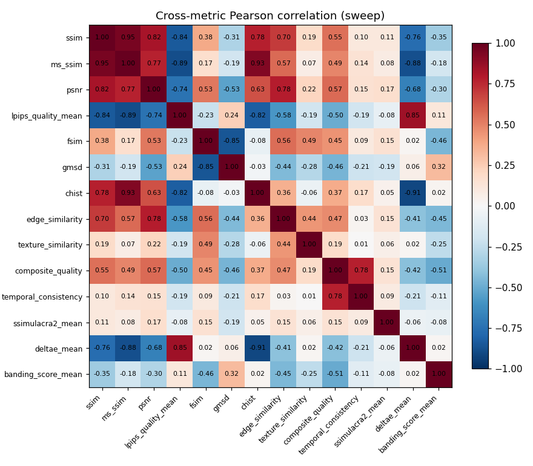

Metric pairs with |r| < 0.2 within the same family (e.g. SSIM vs MS-SSIM) suggest the metrics are measuring different things than expected.

### Distributions (key metrics)

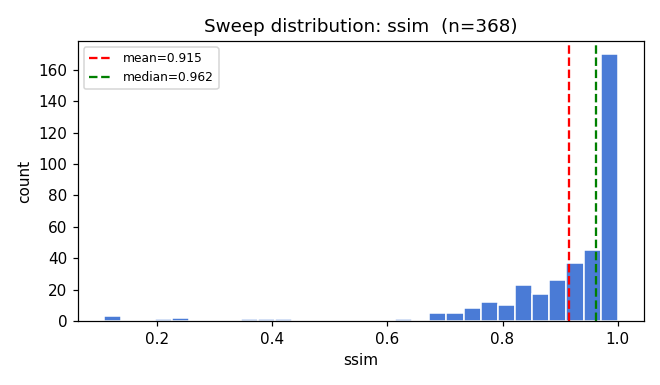

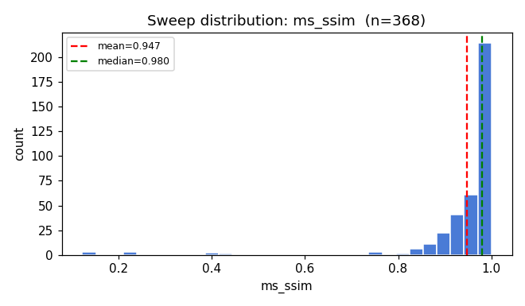

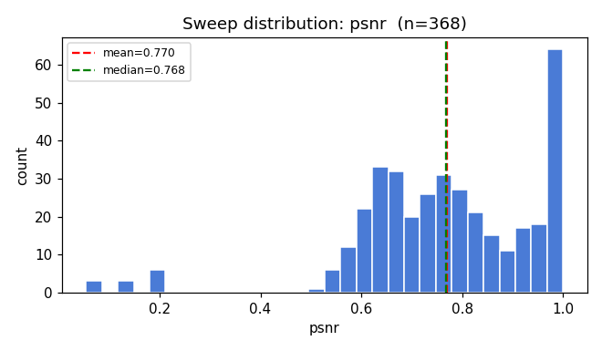

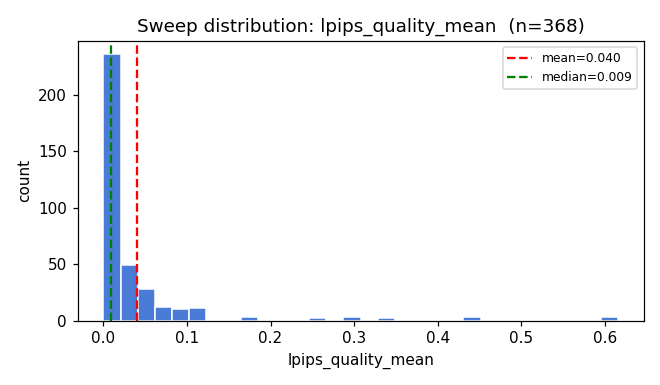

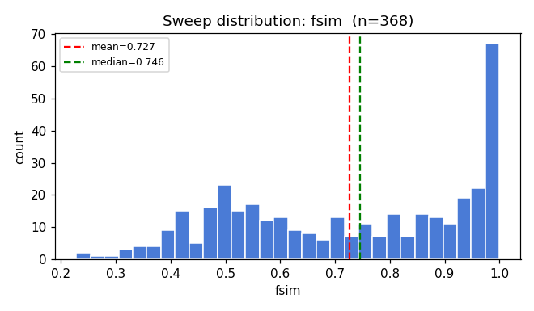

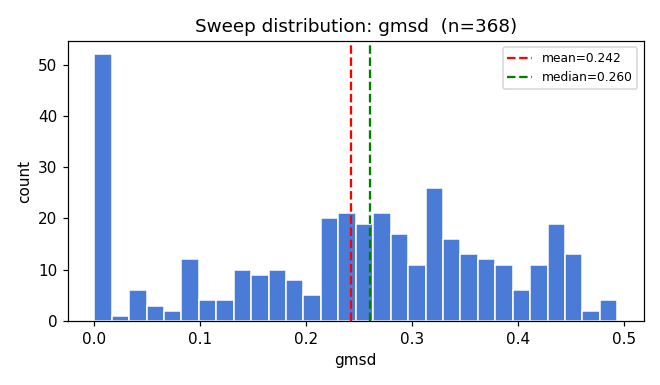

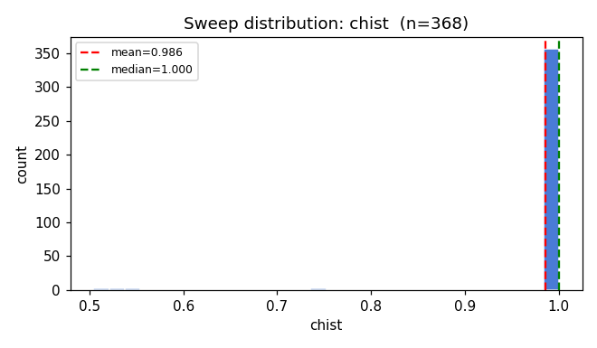

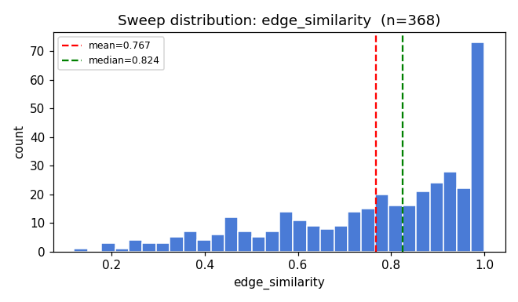

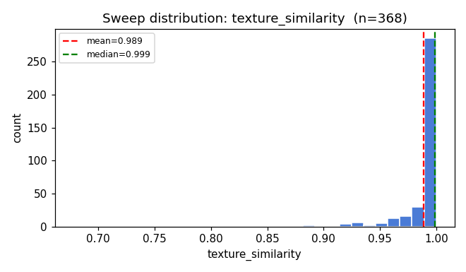

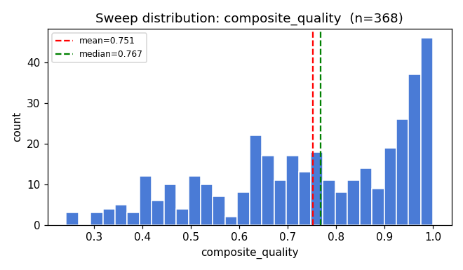

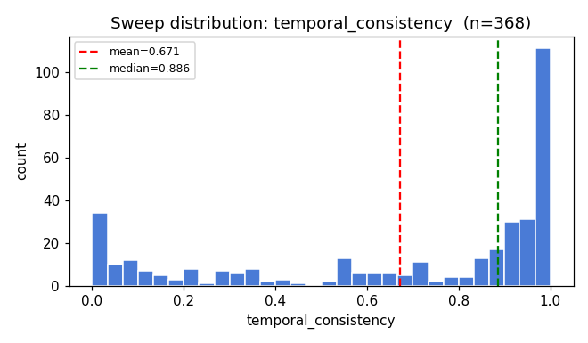

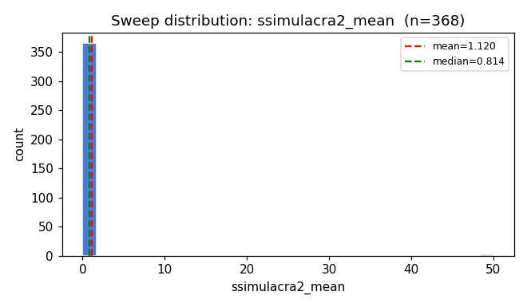

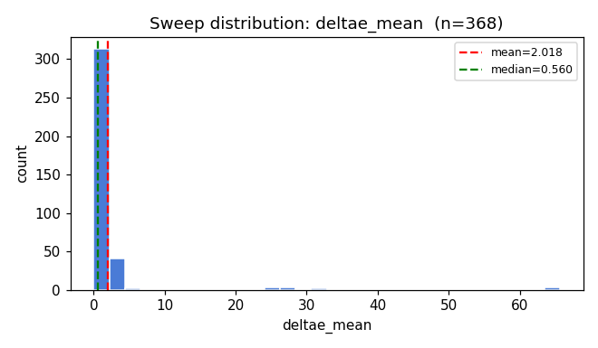

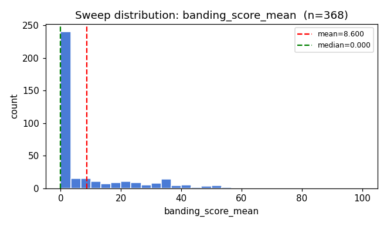

### Top outliers per metric (|z| highest)

#### ssim

| thumb | gif | lossy | source | content_type | value | z |
|---|---|---|---|---|---|---|
|  | https___mcusercontent.com_88adb327dcabde30998542 | 60 | real |  | 0.1077 | -6.04 |
|  | https___mcusercontent.com_88adb327dcabde30998542 | 40 | real |  | 0.1158 | -5.98 |
|  | https___mcusercontent.com_88adb327dcabde30998542 | 20 | real |  | 0.1298 | -5.87 |
|  | https___gstatic.com_growthlab_api_XpkfMAWfUsWgNN | 60 | real |  | 0.2251 | -5.16 |
|  | https___gstatic.com_growthlab_api_XpkfMAWfUsWgNN | 40 | real |  | 0.2276 | -5.14 |

#### ms_ssim

| thumb | gif | lossy | source | content_type | value | z |
|---|---|---|---|---|---|---|
|  | https___mcusercontent.com_88adb327dcabde30998542 | 60 | real |  | 0.1227 | -6.85 |
|  | https___mcusercontent.com_88adb327dcabde30998542 | 40 | real |  | 0.1271 | -6.81 |
|  | https___mcusercontent.com_88adb327dcabde30998542 | 20 | real |  | 0.1339 | -6.76 |
|  | https___gstatic.com_growthlab_api_XpkfMAWfUsWgNN | 60 | real |  | 0.2114 | -6.11 |
|  | https___gstatic.com_growthlab_api_XpkfMAWfUsWgNN | 40 | real |  | 0.2128 | -6.10 |

#### psnr

| thumb | gif | lossy | source | content_type | value | z |
|---|---|---|---|---|---|---|
|  | https___gstatic.com_growthlab_api_XpkfMAWfUsWgNN | 60 | real |  | 0.0542 | -3.97 |
|  | https___gstatic.com_growthlab_api_XpkfMAWfUsWgNN | 40 | real |  | 0.0542 | -3.97 |
|  | https___gstatic.com_growthlab_api_XpkfMAWfUsWgNN | 20 | real |  | 0.0542 | -3.97 |
|  | https___mcusercontent.com_53222dcf7155dec475bbb4 | 60 | real |  | 0.1313 | -3.55 |
|  | https___mcusercontent.com_53222dcf7155dec475bbb4 | 40 | real |  | 0.1314 | -3.55 |

#### lpips_quality_mean

| thumb | gif | lossy | source | content_type | value | z |
|---|---|---|---|---|---|---|
|  | https___gstatic.com_growthlab_api_XpkfMAWfUsWgNN | 60 | real |  | 0.6156 | +6.53 |
|  | https___gstatic.com_growthlab_api_XpkfMAWfUsWgNN | 40 | real |  | 0.6124 | +6.50 |
|  | https___gstatic.com_growthlab_api_XpkfMAWfUsWgNN | 20 | real |  | 0.6105 | +6.48 |
|  | https___mcusercontent.com_88adb327dcabde30998542 | 60 | real |  | 0.4499 | +4.65 |
|  | https___mcusercontent.com_88adb327dcabde30998542 | 40 | real |  | 0.4454 | +4.60 |

#### fsim

| thumb | gif | lossy | source | content_type | value | z |
|---|---|---|---|---|---|---|
| 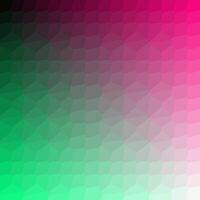 | gradient_large.gif | 60 | synthetic | gradient | 0.2279 | -2.29 |
|  | gradient_medium.gif | 60 | synthetic | gradient | 0.2395 | -2.24 |
|  | https___d3k81ch9hvuctc.cloudfront.net_company_X9 | 60 | real |  | 0.2629 | -2.13 |
|  | https___d3k81ch9hvuctc.cloudfront.net_company_X9 | 40 | real |  | 0.2877 | -2.02 |
| 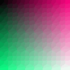 | minimal_frames.gif | 60 | synthetic | gradient | 0.3110 | -1.91 |

#### gmsd

| thumb | gif | lossy | source | content_type | value | z |
|---|---|---|---|---|---|---|
|  | gradient_xlarge.gif | 60 | synthetic | gradient | 0.4934 | +1.79 |
|  | https___userimg-assets.customeriomail.com_images | 40 | real |  | 0.4848 | +1.73 |
|  | high_frequency_detail.gif | 60 | synthetic | detail | 0.0000 | -1.72 |
| 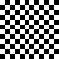 | high_contrast.gif | 20 | synthetic | contrast | 0.0000 | -1.72 |
|  | extended_animation.gif | 20 | synthetic | motion | 0.0000 | -1.72 |

#### chist

| thumb | gif | lossy | source | content_type | value | z |
|---|---|---|---|---|---|---|
|  | https___mcusercontent.com_88adb327dcabde30998542 | 20 | real |  | 0.5043 | -6.29 |
|  | https___mcusercontent.com_88adb327dcabde30998542 | 40 | real |  | 0.5044 | -6.29 |
|  | https___mcusercontent.com_88adb327dcabde30998542 | 60 | real |  | 0.5045 | -6.29 |
|  | https___gstatic.com_growthlab_api_XpkfMAWfUsWgNN | 20 | real |  | 0.5287 | -5.97 |
|  | https___gstatic.com_growthlab_api_XpkfMAWfUsWgNN | 40 | real |  | 0.5288 | -5.97 |

#### edge_similarity

| thumb | gif | lossy | source | content_type | value | z |
|---|---|---|---|---|---|---|
|  | https___mcusercontent.com_cdfc29de68ae93588ec6b0 | 60 | real |  | 0.1200 | -3.01 |
|  | https___mcusercontent.com_cdfc29de68ae93588ec6b0 | 40 | real |  | 0.1794 | -2.74 |
|  | https___mcusercontent.com_88adb327dcabde30998542 | 60 | real |  | 0.1849 | -2.71 |
|  | https___mcusercontent.com_1baa1f1b305949ec908c25 | 60 | real |  | 0.2003 | -2.64 |
|  | https___mcusercontent.com_88adb327dcabde30998542 | 40 | real |  | 0.2127 | -2.58 |

#### texture_similarity

| thumb | gif | lossy | source | content_type | value | z |
|---|---|---|---|---|---|---|
|  | https___mcusercontent.com_cdfc29de68ae93588ec6b0 | 60 | real |  | 0.6775 | -10.83 |
|  | https___mcusercontent.com_cdfc29de68ae93588ec6b0 | 40 | real |  | 0.7408 | -8.62 |
|  | https___i1.cmail20.com_ei_j_05_42F_D59_091032_cs | 60 | real |  | 0.8561 | -4.61 |
|  | https___i1.cmail20.com_ei_j_05_42F_D59_091032_cs | 40 | real |  | 0.8846 | -3.62 |
|  | texture_complex.gif | 60 | synthetic | texture | 0.8867 | -3.55 |

#### composite_quality

| thumb | gif | lossy | source | content_type | value | z |
|---|---|---|---|---|---|---|
|  | https___gstatic.com_growthlab_api_XpkfMAWfUsWgNN | 60 | real |  | 0.2422 | -2.53 |
|  | https___gstatic.com_growthlab_api_XpkfMAWfUsWgNN | 40 | real |  | 0.2427 | -2.52 |
|  | https___gstatic.com_growthlab_api_XpkfMAWfUsWgNN | 20 | real |  | 0.2429 | -2.52 |
|  | https___i1.cmail20.com_ei_j_05_42F_D59_091032_cs | 60 | real |  | 0.2958 | -2.26 |
| .png) | https___mcusercontent.com_02daa6a2f0aa90cc9c88c6 | 60 | real |  | 0.2981 | -2.25 |

#### temporal_consistency

| thumb | gif | lossy | source | content_type | value | z |
|---|---|---|---|---|---|---|
| .png) | https___mcusercontent.com_02daa6a2f0aa90cc9c88c6 | 40 | real |  | 0.0000 | -1.82 |
| .png) | https___mcusercontent.com_02daa6a2f0aa90cc9c88c6 | 20 | real |  | 0.0000 | -1.82 |
| .png) | https___mcusercontent.com_02daa6a2f0aa90cc9c88c6 | 60 | real |  | 0.0000 | -1.82 |
| 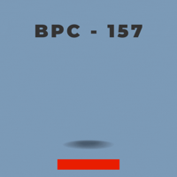 | https___d3k81ch9hvuctc.cloudfront.net_company_Vn | 20 | real |  | 0.0000 | -1.82 |
|  | https___d3k81ch9hvuctc.cloudfront.net_company_Vn | 40 | real |  | 0.0000 | -1.82 |

#### ssimulacra2_mean

| thumb | gif | lossy | source | content_type | value | z |
|---|---|---|---|---|---|---|
|  | https___media.wordfly.com_malthousetheatre_email | 20 | real |  | 50.0000 | +10.99 |
|  | https___media.wordfly.com_malthousetheatre_email | 40 | real |  | 50.0000 | +10.99 |
|  | https___media.wordfly.com_malthousetheatre_email | 60 | real |  | 50.0000 | +10.99 |
|  | https___gstatic.com_growthlab_api_XpkfMAWfUsWgNN | 60 | real |  | 0.0000 | -0.25 |
|  | https___mcusercontent.com_88adb327dcabde30998542 | 20 | real |  | 0.0000 | -0.25 |

#### deltae_mean

| thumb | gif | lossy | source | content_type | value | z |
|---|---|---|---|---|---|---|
|  | https___gstatic.com_growthlab_api_XpkfMAWfUsWgNN | 60 | real |  | 65.6476 | +8.88 |
|  | https___gstatic.com_growthlab_api_XpkfMAWfUsWgNN | 40 | real |  | 65.6374 | +8.88 |
|  | https___gstatic.com_growthlab_api_XpkfMAWfUsWgNN | 20 | real |  | 65.6263 | +8.88 |
|  | https___mcusercontent.com_53222dcf7155dec475bbb4 | 60 | real |  | 31.1335 | +4.06 |
|  | https___mcusercontent.com_53222dcf7155dec475bbb4 | 40 | real |  | 30.7475 | +4.01 |

#### banding_score_mean

| thumb | gif | lossy | source | content_type | value | z |
|---|---|---|---|---|---|---|
| .png) | https___mcusercontent.com_02daa6a2f0aa90cc9c88c6 | 60 | real |  | 100.0000 | +5.95 |
|  | https___d3k81ch9hvuctc.cloudfront.net_company_Vn | 60 | real |  | 74.8341 | +4.31 |
|  | https___d3k81ch9hvuctc.cloudfront.net_company_Vn | 40 | real |  | 68.7767 | +3.92 |
|  | https___mcusercontent.com_5a6eda7241a0bb8bb0a2ab | 60 | real |  | 56.9335 | +3.15 |
|  | https___mcusercontent.com_52cce2d9ba60a58f04e3e1 | 60 | real |  | 56.6249 | +3.13 |

### Cross-metric disagreement (top-spread GIFs)

GIFs where the best-ranked metric and the worst-ranked metric are far apart. Inspect these to see whether one of the metrics is mis-firing on this kind of content.

| thumb | gif | lossy | source | content_type | spread | best→ | worst→ |
|---|---|---|---|---|---|---|---|
| .png) | https___mcusercontent.com_02daa6a2f0aa90cc9c88c6 | 20 | real |  | 0.99 | ssimulacra2_mean | temporal_consistency |
|  | minimal_frames.gif | 60 | synthetic | gradient | 0.98 | temporal_consistency | fsim |
|  | https___userimg-assets.customeriomail.com_images | 40 | real |  | 0.98 | banding_score_mean | gmsd |
|  | https___userimg-assets.customeriomail.com_images | 20 | real |  | 0.98 | banding_score_mean | gmsd |
|  | https___email.wetransfer.net_WeNewsletter_Genera | 60 | real |  | 0.96 | banding_score_mean | ssimulacra2_mean |
| .png) | https___mcusercontent.com_02daa6a2f0aa90cc9c88c6 | 40 | real |  | 0.96 | deltae_mean | temporal_consistency |
|  | minimal_frames.gif | 40 | synthetic | gradient | 0.95 | temporal_consistency | gmsd |
|  | https___cdn2.allevents.in_transup_e9_09956161374 | 20 | real |  | 0.94 | banding_score_mean | temporal_consistency |
|  | https___userimg-assets.customeriomail.com_images | 60 | real |  | 0.94 | banding_score_mean | gmsd |
|  | gradient_small.gif | 40 | synthetic | gradient | 0.94 | edge_similarity | chist |

### Synthetic per-content-type means (key metrics)

| content_type | ssim | ms_ssim | psnr | lpips_quality_mean | fsim | gmsd | chist | edge_similarity | texture_similarity | composite_quality | temporal_consistency | ssimulacra2_mean | deltae_mean | banding_score_mean |
|---|---|---|---|---|---|---|---|---|---|---|---|---|---|---|
| charts | 1.000 | 1.000 | 1.000 | 0.000 | 1.000 | 0.000 | 1.000 | 1.000 | 1.000 | 0.999 | 0.997 | 1.000 | 0.000 | 0.000 |
| complex_gradient | 0.933 | 0.968 | 0.736 | 0.009 | 0.592 | 0.375 | 0.998 | 0.592 | 0.992 | 0.958 | 1.000 | 0.767 | 0.778 | 0.000 |
| contrast | 1.000 | 1.000 | 1.000 | 0.000 | 1.000 | 0.000 | 1.000 | 1.000 | 1.000 | 1.000 | 1.000 | 1.000 | 0.000 | 0.000 |
| detail | 1.000 | 1.000 | 1.000 | 0.000 | 1.000 | 0.000 | 1.000 | 1.000 | 1.000 | 1.000 | 1.000 | 1.000 | 0.000 | 0.000 |
| geometric | 1.000 | 1.000 | 1.000 | 0.000 | 1.000 | 0.000 | 1.000 | 1.000 | 1.000 | 1.000 | 1.000 | 1.000 | 0.000 | 0.000 |
| gradient | 0.930 | 0.962 | 0.757 | 0.048 | 0.596 | 0.331 | 0.996 | 0.777 | 0.983 | 0.918 | 0.951 | 0.619 | 0.784 | 0.000 |
| micro_detail | 0.998 | 0.999 | 0.863 | 0.009 | 0.997 | 0.048 | 1.000 | 0.372 | 1.000 | 0.853 | 0.629 | 0.932 | 0.023 | 0.000 |
| minimal | 1.000 | 1.000 | 1.000 | 0.000 | 1.000 | 0.000 | 1.000 | 1.000 | 1.000 | 1.000 | 1.000 | 1.000 | 0.000 | 0.000 |
| mixed | 1.000 | 1.000 | 1.000 | 0.000 | 0.983 | 0.008 | 1.000 | 1.000 | 1.000 | 0.980 | 0.945 | 1.000 | 0.004 | 0.000 |
| morph | 1.000 | 1.000 | 1.000 | 0.000 | 1.000 | 0.000 | 1.000 | 1.000 | 1.000 | 0.941 | 0.841 | 1.000 | 0.000 | 0.000 |
| motion | 1.000 | 1.000 | 1.000 | 0.000 | 1.000 | 0.000 | 1.000 | 1.000 | 1.000 | 0.970 | 0.918 | 1.000 | 0.000 | 0.000 |
| noise | 0.965 | 0.975 | 0.681 | 0.014 | 0.882 | 0.085 | 1.000 | 0.715 | 1.000 | 0.914 | 0.972 | 0.588 | 1.458 | 0.000 |
| solid | 1.000 | 1.000 | 1.000 | 0.000 | 1.000 | 0.000 | 1.000 | 1.000 | 1.000 | 1.000 | 1.000 | 1.000 | 0.000 | 0.000 |
| spectrum | 0.930 | 0.968 | 0.752 | 0.009 | 0.715 | 0.315 | 1.000 | 0.658 | 0.997 | 0.962 | 1.000 | 0.784 | 0.672 | 0.000 |
| static_plus | 0.898 | 0.946 | 0.873 | 0.124 | 0.834 | 0.161 | 1.000 | 0.906 | 0.994 | 0.845 | 0.708 | 0.779 | 0.227 | 0.000 |
| texture | 0.908 | 0.957 | 0.700 | 0.053 | 0.519 | 0.266 | 0.999 | 0.642 | 0.930 | 0.935 | 1.000 | 0.755 | 1.612 | 0.000 |

---

Generated by `scripts/audit/report.py`. Source CSVs: `report.py` arguments. Re-run any of the audit scripts to refresh.