# GifLab metrics audit

Three-phase audit: (1) sanity tests on synthetic content, (2) lossy calibration pilot, (3) corpus sweep at the chosen lossy levels. Findings are advisory — the goal is to surface anything weird in metric behaviour, not to ship fixes.

## Phase 2 — pilot calibration

**Chosen lossy levels for the main sweep:** `[20, 40, 60]`

Rationale:
- lossy=20 maximises cross-metric disagreement (score 1.000)
- lossy=40 also high disagreement (score 1.000, 1.00x of peak)
- lossy=60 also high disagreement (score 1.000, 1.00x of peak)

**Cross-metric disagreement by lossy level:**

| lossy | disagreement |
|---|---|
| 0 | 0.952 |
| 20 | 1.000 |
| 40 | 1.000 |
| 60 | 1.000 |
| 80 | 1.000 |
| 100 | 1.000 |
| 140 | 1.000 |
| 200 | 1.000 |

**Response curves (one line per pilot GIF):**

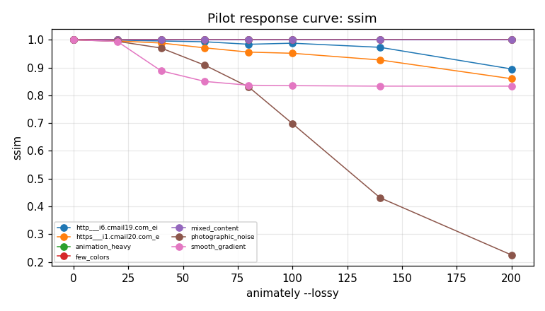

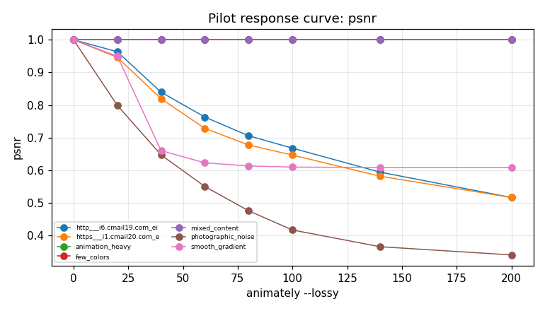

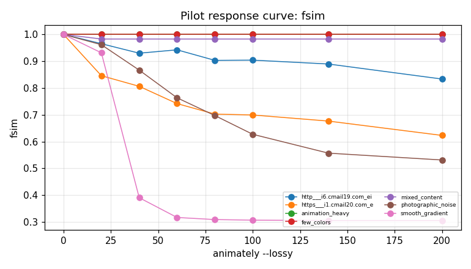

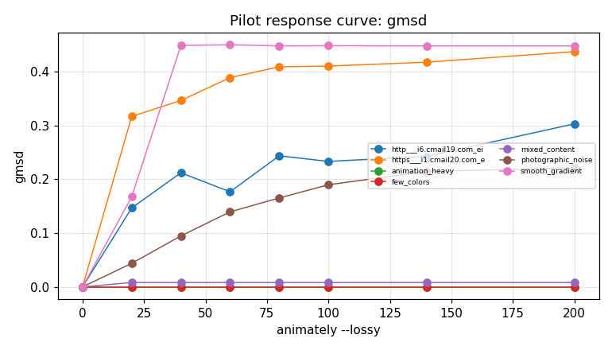

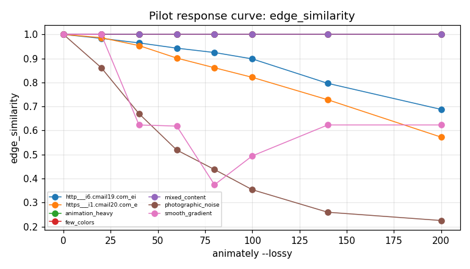

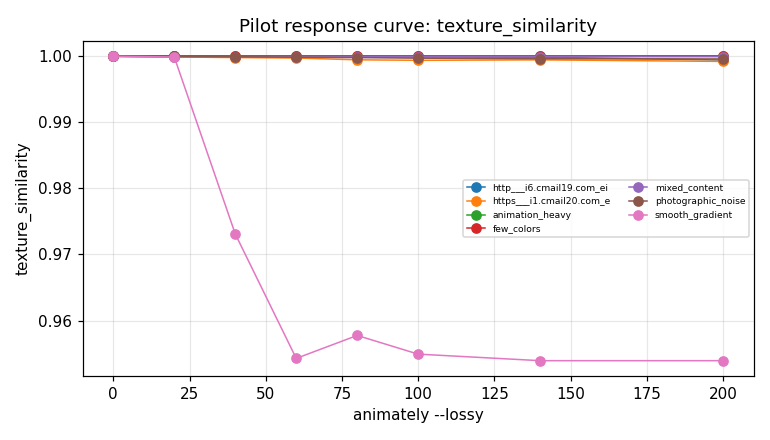

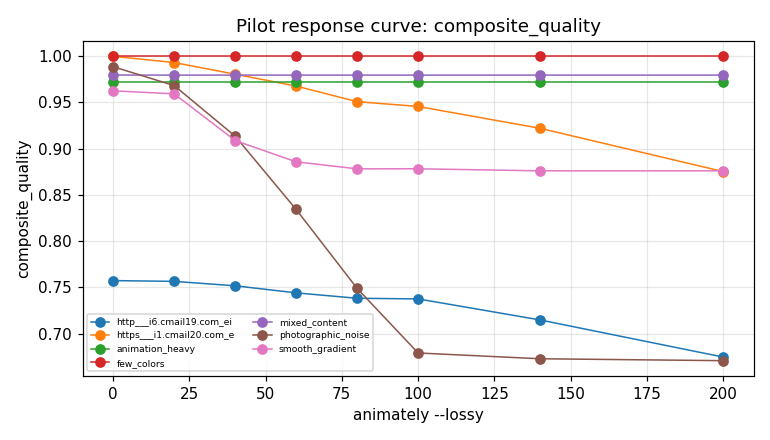

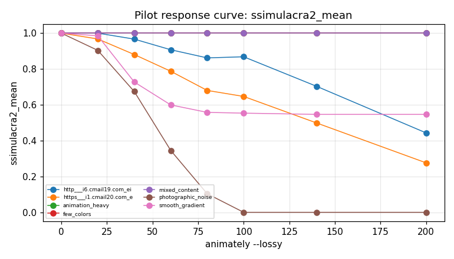

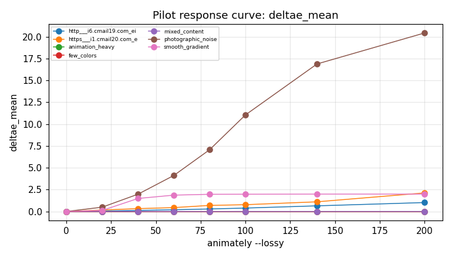

## Phase 1 — sanity verdicts

Identity = metric on (gif, gif). Pathological = metric on (white, black). Direction inferred from those two reference points. Verdict PASS if monotonicity holds across all degradation kinds (noise / blur / quantize / animately lossy). SUSPICIOUS if any kind shows an inversion. INCONCLUSIVE if identity == pathological (usually a single-stream metric where this pair can't discriminate).

| metric | identity_mean | pathological | direction | verdict | note |
|---|---|---|---|---|---|
| alignment_accuracy | 1.0000 | 1.0000 | flat | INCONCLUSIVE | identity and both pathological pairs (solid + structural) gave identical values — metric doesn't discriminate even on (gradient vs inverse) |
| alignment_warning | 0.0000 | 0.0000 | flat | INCONCLUSIVE | identity and both pathological pairs (solid + structural) gave identical values — metric doesn't discriminate even on (gradient vs inverse) |
| banding_patch_count | 0.0000 | 0.0000 | flat | INCONCLUSIVE | identity and both pathological pairs (solid + structural) gave identical values — metric doesn't discriminate even on (gradient vs inverse) |
| banding_score_mean | 0.0000 | 0.0000 | flat | INCONCLUSIVE | identity and both pathological pairs (solid + structural) gave identical values — metric doesn't discriminate even on (gradient vs inverse) |
| banding_score_p95 | 0.0000 | 0.0000 | flat | INCONCLUSIVE | identity and both pathological pairs (solid + structural) gave identical values — metric doesn't discriminate even on (gradient vs inverse) |
| chist | 1.0000 | 0.3414 | higher_better | SUSPICIOUS | 4 monotonicity violation(s); patho=structural |
| chist_first | 1.0000 | 0.1713 | higher_better | SUSPICIOUS | 5 monotonicity violation(s); patho=structural |
| chist_last | 1.0000 | 0.3062 | higher_better | SUSPICIOUS | 3 monotonicity violation(s); patho=structural |
| chist_max | 1.0000 | 0.4839 | higher_better | SUSPICIOUS | 3 monotonicity violation(s); patho=solid |
| chist_mean | 1.0000 | 0.3414 | higher_better | SUSPICIOUS | 4 monotonicity violation(s); patho=structural |
| chist_middle | 1.0000 | 0.1713 | higher_better | SUSPICIOUS | 4 monotonicity violation(s); patho=structural |
| chist_min | 1.0000 | 0.1713 | higher_better | SUSPICIOUS | 4 monotonicity violation(s); patho=structural |
| chist_positional_variance | 0.0000 | 0.0040 | lower_better | SUSPICIOUS | 8 monotonicity violation(s); patho=structural |
| chist_std | 0.0000 | 0.1249 | lower_better | SUSPICIOUS | 9 monotonicity violation(s); patho=structural |
| color_count_compressed | 103.2750 | 251.3750 | lower_better | SUSPICIOUS | 7 monotonicity violation(s); patho=structural |
| color_count_original | 103.2750 | 251.3750 | lower_better | PASS | patho=structural |
| color_patch_count | 11.6000 | 1.0000 | higher_better | PASS | patho=solid |
| composite_quality | 1.0000 | 0.1858 | higher_better | SUSPICIOUS | 1 monotonicity violation(s); patho=solid |
| compressed_frame_count | 6.8000 | 1.0000 | higher_better | PASS | patho=solid |
| compression_ratio | 1.0000 | 1.0000 | flat | INCONCLUSIVE | identity and both pathological pairs (solid + structural) gave identical values — metric doesn't discriminate even on (gradient vs inverse) |
| deep_perceptual_downscaled | 0.0000 | 0.0000 | flat | INCONCLUSIVE | identity and both pathological pairs (solid + structural) gave identical values — metric doesn't discriminate even on (gradient vs inverse) |
| deep_perceptual_frame_count | 6.8000 | 1.0000 | higher_better | PASS | patho=solid |
| deltae_max | 0.0000 | 100.0000 | lower_better | SUSPICIOUS | 1 monotonicity violation(s); patho=solid |
| deltae_mean | 0.0000 | 100.0000 | lower_better | PASS | patho=solid |
| deltae_p95 | 0.0000 | 100.0000 | lower_better | PASS | patho=solid |
| deltae_pct_gt1 | 0.0000 | 100.0000 | lower_better | PASS | patho=solid |
| deltae_pct_gt2 | 0.0000 | 100.0000 | lower_better | SUSPICIOUS | 1 monotonicity violation(s); patho=solid |
| deltae_pct_gt3 | 0.0000 | 100.0000 | lower_better | PASS | patho=solid |
| deltae_pct_gt5 | 0.0000 | 100.0000 | lower_better | PASS | patho=solid |
| disposal_artifacts_compressed | 0.8202 | 1.0000 | lower_better | SUSPICIOUS | 12 monotonicity violation(s); patho=solid |
| disposal_artifacts_compressed_max | 0.8202 | 1.0000 | lower_better | SUSPICIOUS | 12 monotonicity violation(s); patho=solid |
| disposal_artifacts_compressed_min | 0.8202 | 1.0000 | lower_better | SUSPICIOUS | 12 monotonicity violation(s); patho=solid |
| disposal_artifacts_compressed_std | 0.0000 | 0.0000 | flat | INCONCLUSIVE | identity and both pathological pairs (solid + structural) gave identical values — metric doesn't discriminate even on (gradient vs inverse) |
| disposal_artifacts_delta | 0.0000 | 0.2161 | lower_better | SUSPICIOUS | 7 monotonicity violation(s); patho=structural |
| disposal_artifacts_original | 0.8202 | 1.0000 | lower_better | PASS | patho=solid |
| disposal_artifacts_post | 0.8202 | 1.0000 | lower_better | SUSPICIOUS | 12 monotonicity violation(s); patho=solid |
| disposal_artifacts_pre | 0.8202 | 1.0000 | lower_better | PASS | patho=solid |
| dither_quality_score | 0.0000 | 0.0000 | flat | INCONCLUSIVE | identity and both pathological pairs (solid + structural) gave identical values — metric doesn't discriminate even on (gradient vs inverse) |
| dither_ratio_mean | 0.0000 | 0.0000 | flat | INCONCLUSIVE | identity and both pathological pairs (solid + structural) gave identical values — metric doesn't discriminate even on (gradient vs inverse) |
| dither_ratio_p95 | 0.0000 | 0.0000 | flat | INCONCLUSIVE | identity and both pathological pairs (solid + structural) gave identical values — metric doesn't discriminate even on (gradient vs inverse) |
| duration_diff_ms | 0.0000 | 0.0000 | flat | INCONCLUSIVE | identity and both pathological pairs (solid + structural) gave identical values — metric doesn't discriminate even on (gradient vs inverse) |
| edge_similarity | 1.0000 | 0.0000 | higher_better | SUSPICIOUS | 1 monotonicity violation(s); patho=solid |
| edge_similarity_max | 1.0000 | 0.0000 | higher_better | SUSPICIOUS | 2 monotonicity violation(s); patho=solid |
| edge_similarity_mean | 1.0000 | 0.0000 | higher_better | SUSPICIOUS | 1 monotonicity violation(s); patho=solid |
| edge_similarity_min | 1.0000 | 0.0000 | higher_better | PASS | patho=solid |
| edge_similarity_std | 0.0000 | 0.4330 | lower_better | SUSPICIOUS | 14 monotonicity violation(s); patho=structural |
| efficiency | 0.4771 | 0.2057 | higher_better | SUSPICIOUS | 6 monotonicity violation(s); patho=solid |
| flat_flicker_ratio_compressed | 0.2216 | 0.0000 | higher_better | SUSPICIOUS | 4 monotonicity violation(s); patho=solid |
| flat_region_count_compressed | 0.0000 | 1.0000 | lower_better | PASS | patho=solid |
| flicker_excess_compressed | 0.1756 | 0.0000 | higher_better | SUSPICIOUS | 12 monotonicity violation(s); patho=solid |
| flicker_frame_ratio_compressed | 1.0000 | 0.0000 | higher_better | SUSPICIOUS | 1 monotonicity violation(s); patho=solid |
| frame_count | 6.8000 | 1.0000 | higher_better | PASS | patho=solid |
| fsim | 1.0000 | 0.0000 | higher_better | SUSPICIOUS | 2 monotonicity violation(s); patho=solid |
| fsim_first | 1.0000 | 0.0000 | higher_better | SUSPICIOUS | 2 monotonicity violation(s); patho=solid |
| fsim_last | 1.0000 | 0.0000 | higher_better | SUSPICIOUS | 3 monotonicity violation(s); patho=solid |
| fsim_max | 1.0000 | 0.0000 | higher_better | SUSPICIOUS | 2 monotonicity violation(s); patho=solid |
| fsim_mean | 1.0000 | 0.0000 | higher_better | SUSPICIOUS | 2 monotonicity violation(s); patho=solid |
| fsim_middle | 1.0000 | 0.0000 | higher_better | SUSPICIOUS | 1 monotonicity violation(s); patho=solid |
| fsim_min | 1.0000 | 0.0000 | higher_better | SUSPICIOUS | 3 monotonicity violation(s); patho=solid |
| fsim_positional_variance | 0.0000 | 0.0005 | flat | INCONCLUSIVE | identity and both pathological pairs (solid + structural) gave identical values — metric doesn't discriminate even on (gradient vs inverse) |
| fsim_std | 0.0000 | 0.0202 | lower_better | SUSPICIOUS | 11 monotonicity violation(s); patho=structural |
| gmsd | 0.0000 | 0.5000 | lower_better | SUSPICIOUS | 9 monotonicity violation(s); patho=solid |
| gmsd_max | 0.0000 | 0.5000 | lower_better | SUSPICIOUS | 9 monotonicity violation(s); patho=solid |
| gmsd_mean | 0.0000 | 0.5000 | lower_better | SUSPICIOUS | 9 monotonicity violation(s); patho=solid |
| gmsd_min | 0.0000 | 0.5000 | lower_better | SUSPICIOUS | 9 monotonicity violation(s); patho=solid |
| gmsd_std | 0.0000 | 0.0130 | lower_better | SUSPICIOUS | 15 monotonicity violation(s); patho=structural |
| gradient_region_count | 0.0000 | 0.0000 | flat | INCONCLUSIVE | identity and both pathological pairs (solid + structural) gave identical values — metric doesn't discriminate even on (gradient vs inverse) |
| grid_length | 80.0000 | 10.0000 | higher_better | PASS | patho=solid |
| has_text_ui_content | 0.4000 | 0.0000 | higher_better | PASS | patho=solid |
| kilobytes | 55.2578 | 0.2168 | higher_better | SUSPICIOUS | 11 monotonicity violation(s); patho=solid |
| lpips_quality_max | 0.0000 | 0.8052 | lower_better | PASS | patho=solid |
| lpips_quality_mean | 0.0000 | 0.8052 | lower_better | PASS | patho=solid |
| lpips_quality_p95 | 0.0000 | 0.8052 | lower_better | PASS | patho=solid |
| lpips_t_mean_compressed | 0.1956 | 0.0000 | higher_better | SUSPICIOUS | 12 monotonicity violation(s); patho=solid |
| lpips_t_p95_compressed | 0.2258 | 0.0000 | higher_better | SUSPICIOUS | 13 monotonicity violation(s); patho=solid |
| max_timing_drift_ms | 0.0000 | 0.0000 | flat | INCONCLUSIVE | identity and both pathological pairs (solid + structural) gave identical values — metric doesn't discriminate even on (gradient vs inverse) |
| ms_ssim | 1.0000 | -0.0549 | higher_better | PASS | patho=structural |
| ms_ssim_max | 1.0000 | -0.0295 | higher_better | PASS | patho=structural |
| ms_ssim_mean | 1.0000 | -0.0549 | higher_better | PASS | patho=structural |
| ms_ssim_min | 1.0000 | -0.0764 | higher_better | SUSPICIOUS | 1 monotonicity violation(s); patho=structural |
| ms_ssim_std | 0.0000 | 0.0171 | lower_better | SUSPICIOUS | 7 monotonicity violation(s); patho=structural |
| mse | 0.0000 | 65025.0000 | lower_better | SUSPICIOUS | 1 monotonicity violation(s); patho=solid |
| mse_first | 0.0000 | 65025.0000 | lower_better | PASS | patho=solid |
| mse_last | 0.0000 | 65025.0000 | lower_better | SUSPICIOUS | 2 monotonicity violation(s); patho=solid |
| mse_max | 0.0000 | 65025.0000 | lower_better | SUSPICIOUS | 2 monotonicity violation(s); patho=solid |
| mse_mean | 0.0000 | 65025.0000 | lower_better | SUSPICIOUS | 1 monotonicity violation(s); patho=solid |
| mse_middle | 0.0000 | 65025.0000 | lower_better | SUSPICIOUS | 1 monotonicity violation(s); patho=solid |
| mse_min | 0.0000 | 65025.0000 | lower_better | PASS | patho=solid |
| mse_positional_variance | 0.0000 | 10.7677 | lower_better | SUSPICIOUS | 6 monotonicity violation(s); patho=structural |
| mse_std | 0.0000 | 4.8306 | lower_better | SUSPICIOUS | 8 monotonicity violation(s); patho=structural |
| ocr_regions_analyzed | 0.0000 | nan | lower_better | PASS | patho=solid |
| palette_distance | 0.0000 | 441.6730 | lower_better | SUSPICIOUS | 1 monotonicity violation(s); patho=solid |
| posterization_score | 0.0000 | 0.0000 | flat | INCONCLUSIVE | identity and both pathological pairs (solid + structural) gave identical values — metric doesn't discriminate even on (gradient vs inverse) |
| psnr | 1.0000 | 0.0000 | higher_better | PASS | patho=solid |
| psnr_max | 1.0000 | 0.0000 | higher_better | PASS | patho=solid |
| psnr_mean | 100.0000 | 0.0000 | higher_better | PASS | patho=solid |
| psnr_min | 1.0000 | 0.0000 | higher_better | SUSPICIOUS | 2 monotonicity violation(s); patho=solid |
| psnr_std | 0.0000 | 0.0000 | flat | INCONCLUSIVE | identity and both pathological pairs (solid + structural) gave identical values — metric doesn't discriminate even on (gradient vs inverse) |
| quality_oscillation_frequency_compressed | 0.4857 | 0.0000 | higher_better | SUSPICIOUS | 9 monotonicity violation(s); patho=solid |
| render_ms | 3952.4000 | 65.0000 | higher_better | SUSPICIOUS | 20 monotonicity violation(s); patho=solid |
| rmse | 0.0000 | 255.0000 | lower_better | PASS | patho=solid |
| rmse_max | 0.0000 | 255.0000 | lower_better | SUSPICIOUS | 2 monotonicity violation(s); patho=solid |
| rmse_mean | 0.0000 | 255.0000 | lower_better | PASS | patho=solid |
| rmse_min | 0.0000 | 255.0000 | lower_better | PASS | patho=solid |
| rmse_std | 0.0000 | 0.0190 | lower_better | SUSPICIOUS | 11 monotonicity violation(s); patho=structural |
| sharpness_similarity | 1.0000 | 0.0000 | higher_better | SUSPICIOUS | 1 monotonicity violation(s); patho=solid |
| sharpness_similarity_max | 1.0000 | 0.0000 | higher_better | SUSPICIOUS | 2 monotonicity violation(s); patho=solid |
| sharpness_similarity_mean | 1.0000 | 0.0000 | higher_better | SUSPICIOUS | 1 monotonicity violation(s); patho=solid |
| sharpness_similarity_min | 1.0000 | 0.0000 | higher_better | SUSPICIOUS | 3 monotonicity violation(s); patho=solid |
| sharpness_similarity_std | 0.0000 | 0.0882 | lower_better | SUSPICIOUS | 13 monotonicity violation(s); patho=structural |
| ssim | 1.0000 | 0.0001 | higher_better | PASS | patho=solid |
| ssim_first | 1.0000 | 0.0001 | higher_better | PASS | patho=solid |
| ssim_last | 1.0000 | 0.0001 | higher_better | SUSPICIOUS | 1 monotonicity violation(s); patho=solid |
| ssim_max | 1.0000 | 0.0001 | higher_better | PASS | patho=solid |
| ssim_mean | 1.0000 | 0.0001 | higher_better | PASS | patho=solid |
| ssim_middle | 1.0000 | 0.0001 | higher_better | PASS | patho=solid |
| ssim_min | 1.0000 | 0.0001 | higher_better | SUSPICIOUS | 1 monotonicity violation(s); patho=solid |
| ssim_positional_variance | 0.0000 | 0.0000 | flat | INCONCLUSIVE | identity and both pathological pairs (solid + structural) gave identical values — metric doesn't discriminate even on (gradient vs inverse) |
| ssim_std | 0.0000 | 0.0099 | lower_better | SUSPICIOUS | 12 monotonicity violation(s); patho=structural |
| ssimulacra2_frame_count | 6.8000 | 1.0000 | higher_better | PASS | patho=solid |
| ssimulacra2_mean | 1.0000 | 0.0000 | higher_better | PASS | patho=solid |
| ssimulacra2_min | 1.0000 | 0.0000 | higher_better | PASS | patho=solid |
| ssimulacra2_p95 | 1.0000 | 0.0000 | higher_better | PASS | patho=solid |
| ssimulacra2_triggered | 1.0000 | 1.0000 | flat | INCONCLUSIVE | identity and both pathological pairs (solid + structural) gave identical values — metric doesn't discriminate even on (gradient vs inverse) |
| temporal_consistency_compressed | 0.9737 | 0.8991 | higher_better | SUSPICIOUS | 9 monotonicity violation(s); patho=structural |
| temporal_consistency_compressed_max | 0.9737 | 0.8991 | higher_better | SUSPICIOUS | 9 monotonicity violation(s); patho=structural |
| temporal_consistency_compressed_min | 0.9737 | 0.8991 | higher_better | SUSPICIOUS | 9 monotonicity violation(s); patho=structural |
| temporal_consistency_compressed_std | 0.0000 | 0.0000 | flat | INCONCLUSIVE | identity and both pathological pairs (solid + structural) gave identical values — metric doesn't discriminate even on (gradient vs inverse) |
| temporal_consistency_delta | 0.0000 | 0.0000 | flat | INCONCLUSIVE | identity and both pathological pairs (solid + structural) gave identical values — metric doesn't discriminate even on (gradient vs inverse) |
| temporal_consistency_original | 0.9737 | 0.8991 | higher_better | PASS | patho=structural |
| temporal_consistency_post | 0.9737 | 0.8991 | higher_better | SUSPICIOUS | 9 monotonicity violation(s); patho=structural |
| temporal_consistency_pre | 0.9737 | 0.8991 | higher_better | PASS | patho=structural |
| temporal_pumping_score_compressed | 0.0013 | 0.0000 | higher_better | SUSPICIOUS | 13 monotonicity violation(s); patho=solid |
| text_ui_component_count | 0.0000 | 0.0000 | flat | INCONCLUSIVE | identity and both pathological pairs (solid + structural) gave identical values — metric doesn't discriminate even on (gradient vs inverse) |
| text_ui_edge_density | 0.1268 | 0.0000 | higher_better | PASS | patho=solid |
| texture_similarity | 1.0000 | 0.0000 | higher_better | SUSPICIOUS | 5 monotonicity violation(s); patho=solid |
| texture_similarity_max | 1.0000 | 0.0000 | higher_better | SUSPICIOUS | 5 monotonicity violation(s); patho=solid |
| texture_similarity_mean | 1.0000 | 0.0000 | higher_better | SUSPICIOUS | 5 monotonicity violation(s); patho=solid |
| texture_similarity_min | 1.0000 | 0.0000 | higher_better | SUSPICIOUS | 6 monotonicity violation(s); patho=solid |
| texture_similarity_std | 0.0000 | 0.0000 | flat | INCONCLUSIVE | identity and both pathological pairs (solid + structural) gave identical values — metric doesn't discriminate even on (gradient vs inverse) |
| timing_drift_score | 0.0000 | 0.0000 | flat | INCONCLUSIVE | identity and both pathological pairs (solid + structural) gave identical values — metric doesn't discriminate even on (gradient vs inverse) |
| timing_grid_ms | 10.0000 | 10.0000 | flat | INCONCLUSIVE | identity and both pathological pairs (solid + structural) gave identical values — metric doesn't discriminate even on (gradient vs inverse) |
| transparency_artifact_score | 0.0000 | 0.0000 | flat | INCONCLUSIVE | identity and both pathological pairs (solid + structural) gave identical values — metric doesn't discriminate even on (gradient vs inverse) |

### Monotonicity violations (SUSPICIOUS detail)

**chist** — 4 failures
- `lossy` on `smooth_gradient`: [0.9994, 0.9935, 0.9939, 0.9936]
- `noise` on `high_contrast`: [0.9988, 0.9857, 0.9783, 0.9912]
- `blur` on `high_contrast`: [0.9538, 0.7294, 0.3568, 0.4613]
- `blur` on `transparency_bearing`: [0.8402, 0.8358, 0.8414, 0.8237]

**chist_first** — 5 failures
- `quantize` on `smooth_gradient`: [1.0000, 0.5452, 0.3796, 0.4254]
- `lossy` on `smooth_gradient`: [0.9992, 0.9916, 0.9935, 0.9931]
- `quantize` on `photographic_noise`: [1.0000, 0.8006, 0.5944, 0.6204]
- `noise` on `high_contrast`: [0.9989, 0.9848, 0.9788, 0.9909]
- `blur` on `high_contrast`: [0.9538, 0.7294, 0.3568, 0.4613]

**chist_last** — 3 failures
- `noise` on `high_contrast`: [0.9988, 0.9866, 0.9777, 0.9916]
- `blur` on `high_contrast`: [0.9538, 0.7294, 0.3568, 0.4613]
- `blur` on `transparency_bearing`: [0.7041, 0.6978, 0.7447, 0.7263]

**chist_max** — 3 failures
- `quantize` on `smooth_gradient`: [1.0000, 0.6058, 0.4113, 0.4429]
- `noise` on `high_contrast`: [0.9989, 0.9866, 0.9788, 0.9916]
- `blur` on `high_contrast`: [0.9538, 0.7294, 0.3568, 0.4613]

**chist_mean** — 4 failures
- `lossy` on `smooth_gradient`: [0.9994, 0.9935, 0.9939, 0.9936]
- `noise` on `high_contrast`: [0.9988, 0.9857, 0.9783, 0.9912]
- `blur` on `high_contrast`: [0.9538, 0.7294, 0.3568, 0.4613]
- `blur` on `transparency_bearing`: [0.8402, 0.8358, 0.8414, 0.8237]

**chist_middle** — 4 failures
- `lossy` on `smooth_gradient`: [0.9998, 0.9932, 0.9940, 0.9939]
- `noise` on `high_contrast`: [0.9988, 0.9866, 0.9777, 0.9916]
- `blur` on `high_contrast`: [0.9538, 0.7294, 0.3568, 0.4613]
- `blur` on `transparency_bearing`: [0.9108, 0.9169, 0.9154, 0.9004]

**chist_min** — 4 failures
- `lossy` on `smooth_gradient`: [0.9991, 0.9916, 0.9934, 0.9928]
- `noise` on `high_contrast`: [0.9988, 0.9848, 0.9777, 0.9909]
- `blur` on `high_contrast`: [0.9538, 0.7294, 0.3568, 0.4613]
- `blur` on `transparency_bearing`: [0.7041, 0.6978, 0.7447, 0.7263]

**chist_positional_variance** — 8 failures
- `noise` on `smooth_gradient`: [0.0001, 0.0004, 0.0028, 0.0003]
- `quantize` on `smooth_gradient`: [0.0000, 0.0017, 0.0006, 0.0017]
- `noise` on `photographic_noise`: [0.0000, 0.0004, 0.0000, 0.0002]
- `quantize` on `photographic_noise`: [0.0000, 0.0014, 0.0002, 0.0016]
- `noise` on `geometric_patterns`: [0.0000, 0.0001, 0.0004, 0.0000]

**chist_std** — 9 failures
- `noise` on `smooth_gradient`: [0.0069, 0.0255, 0.0463, 0.0201]
- `blur` on `smooth_gradient`: [0.0109, 0.0081, 0.0178, 0.0353]
- `quantize` on `smooth_gradient`: [0.0000, 0.0299, 0.0202, 0.0327]
- `lossy` on `smooth_gradient`: [0.0002, 0.0011, 0.0004, 0.0005]
- `noise` on `high_contrast`: [0.0001, 0.0009, 0.0005, 0.0004]

**color_count_compressed** — 7 failures
- `quantize` on `smooth_gradient`: [251.3750, 61.3750, 14.5000, 4.0000]
- `lossy` on `smooth_gradient`: [251.3750, 251.2500, 251.2500, 251.2500]
- `blur` on `photographic_noise`: [255.8750, 256.0000, 256.0000, 255.8750]
- `quantize` on `photographic_noise`: [256.0000, 45.7500, 16.0000, 4.0000]
- `lossy` on `photographic_noise`: [274.8750, 267.6250, 263.0000, 261.0000]

**composite_quality** — 1 failures
- `lossy` on `smooth_gradient`: [0.9700, 0.7691, 0.7295, 0.7597]

**deltae_max** — 1 failures
- `blur` on `transparency_bearing`: [9.1095, 9.0924, 9.0458, 8.9244]

**deltae_pct_gt2** — 1 failures
- `blur` on `smooth_gradient`: [0.0000, 25.0000, 62.5000, 50.0000]

**disposal_artifacts_compressed** — 12 failures
- `noise` on `smooth_gradient`: [0.6899, 0.5928, 0.5835, 0.9994]
- `blur` on `smooth_gradient`: [0.8495, 0.7090, 0.7438, 0.7357]
- `quantize` on `smooth_gradient`: [0.9060, 0.7022, 0.4406, 0.4424]
- `lossy` on `smooth_gradient`: [0.8992, 0.8056, 0.7866, 0.8003]
- `blur` on `photographic_noise`: [0.5818, 0.4317, 0.4317, 0.4317]

**disposal_artifacts_compressed_max** — 12 failures
- `noise` on `smooth_gradient`: [0.6899, 0.5928, 0.5835, 0.9994]
- `blur` on `smooth_gradient`: [0.8495, 0.7090, 0.7438, 0.7357]
- `quantize` on `smooth_gradient`: [0.9060, 0.7022, 0.4406, 0.4424]
- `lossy` on `smooth_gradient`: [0.8992, 0.8056, 0.7866, 0.8003]
- `blur` on `photographic_noise`: [0.5818, 0.4317, 0.4317, 0.4317]

**disposal_artifacts_compressed_min** — 12 failures
- `noise` on `smooth_gradient`: [0.6899, 0.5928, 0.5835, 0.9994]
- `blur` on `smooth_gradient`: [0.8495, 0.7090, 0.7438, 0.7357]
- `quantize` on `smooth_gradient`: [0.9060, 0.7022, 0.4406, 0.4424]
- `lossy` on `smooth_gradient`: [0.8992, 0.8056, 0.7866, 0.8003]
- `blur` on `photographic_noise`: [0.5818, 0.4317, 0.4317, 0.4317]

**disposal_artifacts_delta** — 7 failures
- `noise` on `smooth_gradient`: [0.2160, 0.3132, 0.3225, 0.0935]
- `blur` on `smooth_gradient`: [0.0564, 0.1970, 0.1622, 0.1703]
- `lossy` on `smooth_gradient`: [0.0068, 0.1004, 0.1194, 0.1057]
- `lossy` on `photographic_noise`: [0.0000, 0.0002, 0.0010, 0.0001]
- `noise` on `geometric_patterns`: [0.0116, 0.3314, 0.3863, 0.0325]

**disposal_artifacts_post** — 12 failures
- `noise` on `smooth_gradient`: [0.6899, 0.5928, 0.5835, 0.9994]
- `blur` on `smooth_gradient`: [0.8495, 0.7090, 0.7438, 0.7357]
- `quantize` on `smooth_gradient`: [0.9060, 0.7022, 0.4406, 0.4424]
- `lossy` on `smooth_gradient`: [0.8992, 0.8056, 0.7866, 0.8003]
- `blur` on `photographic_noise`: [0.5818, 0.4317, 0.4317, 0.4317]

**edge_similarity** — 1 failures
- `lossy` on `smooth_gradient`: [1.0000, 0.9731, 0.4766, 0.9919]

**edge_similarity_max** — 2 failures
- `quantize` on `smooth_gradient`: [1.0000, 0.0027, 0.1790, 0.3514]
- `quantize` on `transparency_bearing`: [1.0000, 1.0000, 0.6941, 0.8000]

**edge_similarity_mean** — 1 failures
- `lossy` on `smooth_gradient`: [1.0000, 0.9731, 0.4766, 0.9919]

**edge_similarity_std** — 14 failures
- `noise` on `smooth_gradient`: [0.4841, 0.0064, 0.0038, 0.0030]
- `blur` on `smooth_gradient`: [0.4841, 0.3307, 0.3307, 0.3307]
- `noise` on `photographic_noise`: [0.0040, 0.0053, 0.0059, 0.0034]
- `blur` on `photographic_noise`: [0.0096, 0.0000, 0.0000, 0.0000]
- `quantize` on `photographic_noise`: [0.0000, 0.0223, 0.0088, 0.0161]

**efficiency** — 6 failures
- `quantize` on `smooth_gradient`: [0.4771, 0.5003, 0.5455, 0.5992]
- `lossy` on `smooth_gradient`: [0.4722, 0.4685, 0.4623, 0.4718]
- `blur` on `photographic_noise`: [0.4157, 0.3089, 0.3232, 0.3666]
- `quantize` on `photographic_noise`: [0.4771, 0.5140, 0.5462, 0.6229]
- `lossy` on `photographic_noise`: [0.4821, 0.5064, 0.5252, 0.5588]

**flat_flicker_ratio_compressed** — 4 failures
- `quantize` on `smooth_gradient`: [0.0000, 0.0000, 1.0000, 1.0000]
- `blur` on `photographic_noise`: [0.0000, 1.0000, 1.0000, 1.0000]
- `blur` on `animation_heavy`: [0.9495, 0.9368, 0.9551, 0.9756]
- `quantize` on `transparency_bearing`: [0.0000, 0.0000, 0.0000, 1.0000]

**flicker_excess_compressed** — 12 failures
- `noise` on `smooth_gradient`: [0.2569, 0.2729, 0.2789, 0.2597]
- `quantize` on `smooth_gradient`: [0.2393, 0.2431, 0.2652, 0.2801]
- `lossy` on `smooth_gradient`: [0.2396, 0.2631, 0.2685, 0.2679]
- `noise` on `photographic_noise`: [0.1604, 0.1558, 0.1650, 0.1951]
- `quantize` on `photographic_noise`: [0.1568, 0.1592, 0.1474, 0.1678]

**flicker_frame_ratio_compressed** — 1 failures
- `blur` on `high_contrast`: [1.0000, 1.0000, 0.0000, 1.0000]

**fsim** — 2 failures
- `blur` on `smooth_gradient`: [0.8941, 0.5029, 0.3876, 0.4198]
- `lossy` on `transparency_bearing`: [0.9287, 0.9290, 0.9269, 0.9279]

**fsim_first** — 2 failures
- `blur` on `smooth_gradient`: [0.9081, 0.4967, 0.4120, 0.4588]
- `lossy` on `transparency_bearing`: [0.9255, 0.9261, 0.9242, 0.9260]

**fsim_last** — 3 failures
- `blur` on `smooth_gradient`: [0.9093, 0.4882, 0.3921, 0.4325]
- `blur` on `transparency_bearing`: [0.4648, 0.4494, 0.2984, 0.3549]
- `lossy` on `transparency_bearing`: [0.9197, 0.9167, 0.9144, 0.9168]

**fsim_max** — 2 failures
- `blur` on `smooth_gradient`: [0.9093, 0.5246, 0.4120, 0.4588]
- `lossy` on `transparency_bearing`: [0.9377, 0.9382, 0.9355, 0.9345]

**fsim_mean** — 2 failures
- `blur` on `smooth_gradient`: [0.8941, 0.5029, 0.3876, 0.4198]
- `lossy` on `transparency_bearing`: [0.9287, 0.9290, 0.9269, 0.9279]

**fsim_middle** — 1 failures
- `lossy` on `transparency_bearing`: [0.9321, 0.9382, 0.9355, 0.9343]

**fsim_min** — 3 failures
- `blur` on `smooth_gradient`: [0.8744, 0.4882, 0.3560, 0.3868]
- `blur` on `transparency_bearing`: [0.4648, 0.4494, 0.2984, 0.3549]
- `lossy` on `transparency_bearing`: [0.9197, 0.9167, 0.9144, 0.9168]

**fsim_std** — 11 failures
- `noise` on `smooth_gradient`: [0.0153, 0.0016, 0.0019, 0.0025]
- `lossy` on `smooth_gradient`: [0.0122, 0.0058, 0.0029, 0.0036]
- `blur` on `photographic_noise`: [0.0041, 0.0007, 0.0006, 0.0001]
- `quantize` on `photographic_noise`: [0.0000, 0.0119, 0.0026, 0.0108]
- `lossy` on `photographic_noise`: [0.0019, 0.0025, 0.0032, 0.0027]

**gmsd** — 9 failures
- `noise` on `smooth_gradient`: [0.4556, 0.4090, 0.3536, 0.2791]
- `blur` on `photographic_noise`: [0.0991, 0.2365, 0.1524, 0.0996]
- `noise` on `high_contrast`: [0.4735, 0.4713, 0.4691, 0.4609]
- `blur` on `high_contrast`: [0.4955, 0.3297, 0.1488, 0.0241]
- `noise` on `geometric_patterns`: [0.2507, 0.2430, 0.2354, 0.2235]

**gmsd_max** — 9 failures
- `noise` on `smooth_gradient`: [0.4578, 0.4146, 0.3605, 0.2877]
- `blur` on `photographic_noise`: [0.1013, 0.2381, 0.1585, 0.1030]
- `noise` on `high_contrast`: [0.4737, 0.4714, 0.4692, 0.4609]
- `blur` on `high_contrast`: [0.4955, 0.3297, 0.1488, 0.0241]
- `noise` on `geometric_patterns`: [0.2544, 0.2453, 0.2388, 0.2275]

**gmsd_mean** — 9 failures
- `noise` on `smooth_gradient`: [0.4556, 0.4090, 0.3536, 0.2791]
- `blur` on `photographic_noise`: [0.0991, 0.2365, 0.1524, 0.0996]
- `noise` on `high_contrast`: [0.4735, 0.4713, 0.4691, 0.4609]
- `blur` on `high_contrast`: [0.4955, 0.3297, 0.1488, 0.0241]
- `noise` on `geometric_patterns`: [0.2507, 0.2430, 0.2354, 0.2235]

**gmsd_min** — 9 failures
- `noise` on `smooth_gradient`: [0.4541, 0.4053, 0.3480, 0.2700]
- `blur` on `photographic_noise`: [0.0971, 0.2344, 0.1483, 0.0967]
- `noise` on `high_contrast`: [0.4732, 0.4713, 0.4691, 0.4608]
- `blur` on `high_contrast`: [0.4955, 0.3297, 0.1488, 0.0241]
- `noise` on `geometric_patterns`: [0.2478, 0.2408, 0.2336, 0.2207]

**gmsd_std** — 15 failures
- `blur` on `smooth_gradient`: [0.0123, 0.0040, 0.0010, 0.0010]
- `quantize` on `smooth_gradient`: [0.0000, 0.0013, 0.0018, 0.0016]
- `lossy` on `smooth_gradient`: [0.0163, 0.0023, 0.0024, 0.0024]
- `noise` on `photographic_noise`: [0.0021, 0.0019, 0.0014, 0.0023]
- `blur` on `photographic_noise`: [0.0012, 0.0011, 0.0028, 0.0023]

**kilobytes** — 11 failures
- `noise` on `smooth_gradient`: [75.8301, 110.1748, 129.9219, 145.3350]
- `blur` on `smooth_gradient`: [48.9326, 50.5029, 50.1953, 49.5371]
- `noise` on `photographic_noise`: [215.1504, 215.6836, 215.6055, 215.4023]
- `noise` on `high_contrast`: [34.8018, 36.5527, 36.5889, 36.6602]
- `blur` on `high_contrast`: [3.4658, 5.0029, 8.9912, 9.0303]

**lpips_t_mean_compressed** — 12 failures
- `noise` on `smooth_gradient`: [0.2769, 0.2929, 0.2989, 0.2797]
- `quantize` on `smooth_gradient`: [0.2593, 0.2631, 0.2852, 0.3001]
- `lossy` on `smooth_gradient`: [0.2596, 0.2831, 0.2885, 0.2879]
- `noise` on `photographic_noise`: [0.1804, 0.1758, 0.1850, 0.2151]
- `quantize` on `photographic_noise`: [0.1768, 0.1792, 0.1674, 0.1878]

**lpips_t_p95_compressed** — 13 failures
- `noise` on `smooth_gradient`: [0.3955, 0.4133, 0.4133, 0.3822]
- `quantize` on `smooth_gradient`: [0.3726, 0.3697, 0.4064, 0.4442]
- `lossy` on `smooth_gradient`: [0.3732, 0.3951, 0.4033, 0.4006]
- `noise` on `photographic_noise`: [0.1951, 0.1906, 0.1925, 0.2426]
- `quantize` on `photographic_noise`: [0.1874, 0.1968, 0.1746, 0.2627]

**ms_ssim_min** — 1 failures
- `blur` on `transparency_bearing`: [0.6112, 0.6189, 0.6203, 0.6012]

**ms_ssim_std** — 7 failures
- `quantize` on `smooth_gradient`: [0.0000, 0.0069, 0.0484, 0.0423]
- `lossy` on `smooth_gradient`: [0.0005, 0.0021, 0.0032, 0.0021]
- `quantize` on `photographic_noise`: [0.0000, 0.0033, 0.0016, 0.0080]
- `noise` on `geometric_patterns`: [0.0010, 0.0016, 0.0026, 0.0024]
- `noise` on `transparency_bearing`: [0.1301, 0.1115, 0.0971, 0.0809]

**mse** — 1 failures
- `blur` on `transparency_bearing`: [3946.2982, 4385.0103, 4307.1221, 4338.5422]

**mse_last** — 2 failures
- `blur` on `transparency_bearing`: [8114.7612, 7920.8813, 5916.1055, 6068.4507]
- `quantize` on `transparency_bearing`: [8174.5688, 8174.6753, 8172.4292, 5931.3984]

**mse_max** — 2 failures
- `blur` on `transparency_bearing`: [8114.7612, 7920.8813, 5916.1055, 6068.4507]
- `quantize` on `transparency_bearing`: [8174.5688, 8174.6753, 8172.4292, 5931.3984]

**mse_mean** — 1 failures
- `blur` on `transparency_bearing`: [3946.2982, 4385.0103, 4307.1221, 4338.5422]

**mse_middle** — 1 failures
- `quantize` on `transparency_bearing`: [2175.6816, 2175.6975, 2180.0713, 2161.2610]

**mse_positional_variance** — 6 failures
- `lossy` on `smooth_gradient`: [0.0611, 0.0973, 5.8707, 5.1358]
- `blur` on `photographic_noise`: [2.9108, 10.8879, 14.7009, 11.6693]
- `blur` on `geometric_patterns`: [0.0617, 0.0112, 0.0085, 0.5757]
- `noise` on `transparency_bearing`: [4253319.5953, 3877528.4318, 3312205.3795, 2176809.9050]
- `blur` on `transparency_bearing`: [9523316.2096, 6396180.0606, 2130638.4455, 2013367.7483]

**mse_std** — 8 failures
- `lossy` on `smooth_gradient`: [0.2188, 0.3844, 1.9937, 1.5512]
- `blur` on `photographic_noise`: [1.8249, 3.9394, 4.0844, 3.9340]
- `quantize` on `photographic_noise`: [0.0000, 11.5147, 6.1975, 48.9698]
- `blur` on `geometric_patterns`: [0.2275, 0.1705, 0.1556, 0.7163]
- `noise` on `transparency_bearing`: [1930.1083, 1836.8753, 1673.1425, 1324.6024]

**palette_distance** — 1 failures
- `lossy` on `photographic_noise`: [0.4601, 0.2907, 0.1874, 0.1403]

**psnr_min** — 2 failures
- `blur` on `transparency_bearing`: [0.1808, 0.1829, 0.2082, 0.2060]
- `quantize` on `transparency_bearing`: [0.1801, 0.1801, 0.1801, 0.2080]

**quality_oscillation_frequency_compressed** — 9 failures
- `noise` on `smooth_gradient`: [0.1429, 0.7143, 0.1429, 0.1429]
- `quantize` on `smooth_gradient`: [0.1429, 0.1429, 0.1429, 0.4286]
- `quantize` on `photographic_noise`: [0.7143, 0.7143, 0.5714, 0.8571]
- `lossy` on `photographic_noise`: [0.7143, 0.8571, 0.7143, 0.7143]
- `noise` on `geometric_patterns`: [0.8571, 0.4286, 0.8571, 0.8571]

**render_ms** — 20 failures
- `noise` on `smooth_gradient`: [3620.0000, 3772.0000, 3587.0000, 3991.0000]
- `blur` on `smooth_gradient`: [3670.0000, 3823.0000, 3674.0000, 4182.0000]
- `quantize` on `smooth_gradient`: [3610.0000, 3588.0000, 3705.0000, 4175.0000]
- `lossy` on `smooth_gradient`: [4220.0000, 4165.0000, 3767.0000, 3941.0000]
- `noise` on `photographic_noise`: [4265.0000, 4508.0000, 4101.0000, 4734.0000]

**rmse_max** — 2 failures
- `blur` on `transparency_bearing`: [90.0820, 88.9993, 76.9162, 77.9003]
- `quantize` on `transparency_bearing`: [90.4133, 90.4139, 90.4015, 77.0156]

**rmse_std** — 11 failures
- `lossy` on `smooth_gradient`: [0.1051, 0.0272, 0.1309, 0.1017]
- `noise` on `photographic_noise`: [0.1186, 0.0586, 0.0747, 0.9488]
- `blur` on `photographic_noise`: [0.0741, 0.0739, 0.0741, 0.0708]
- `quantize` on `photographic_noise`: [0.0000, 0.7680, 0.1981, 1.1989]
- `lossy` on `photographic_noise`: [0.3324, 0.1069, 0.0566, 0.0931]

**sharpness_similarity** — 1 failures
- `noise` on `high_contrast`: [0.9728, 0.9340, 0.9117, 0.9735]

**sharpness_similarity_max** — 2 failures
- `lossy` on `photographic_noise`: [0.9998, 0.9963, 0.9983, 0.9975]
- `noise` on `high_contrast`: [0.9731, 0.9344, 0.9125, 0.9781]

**sharpness_similarity_mean** — 1 failures
- `noise` on `high_contrast`: [0.9728, 0.9340, 0.9117, 0.9735]

**sharpness_similarity_min** — 3 failures
- `noise` on `high_contrast`: [0.9724, 0.9337, 0.9109, 0.9689]
- `blur` on `transparency_bearing`: [0.0067, 0.0087, 0.0080, 0.0010]
- `quantize` on `transparency_bearing`: [0.0202, 0.0203, 0.0297, 0.0483]

**sharpness_similarity_std** — 13 failures
- `noise` on `smooth_gradient`: [0.0239, 0.0044, 0.0012, 0.0004]
- `blur` on `smooth_gradient`: [0.0286, 0.0194, 0.0522, 0.0978]
- `quantize` on `smooth_gradient`: [0.0000, 0.0992, 0.0531, 0.0412]
- `noise` on `photographic_noise`: [0.0057, 0.0078, 0.0072, 0.0110]
- `blur` on `photographic_noise`: [0.0026, 0.0000, 0.0000, 0.0000]

**ssim_last** — 1 failures
- `blur` on `transparency_bearing`: [0.7856, 0.7928, 0.7528, 0.7560]

**ssim_min** — 1 failures
- `blur` on `transparency_bearing`: [0.7856, 0.7928, 0.7528, 0.7560]

**ssim_std** — 12 failures
- `noise` on `smooth_gradient`: [0.0036, 0.0073, 0.0046, 0.0012]
- `quantize` on `smooth_gradient`: [0.0000, 0.0052, 0.0244, 0.0223]
- `lossy` on `smooth_gradient`: [0.0010, 0.0037, 0.0056, 0.0039]
- `blur` on `photographic_noise`: [0.0014, 0.0018, 0.0010, 0.0011]
- `quantize` on `photographic_noise`: [0.0000, 0.0048, 0.0022, 0.0119]

**temporal_consistency_compressed** — 9 failures
- `noise` on `smooth_gradient`: [0.9273, 0.9613, 0.9848, 0.9978]
- `blur` on `smooth_gradient`: [0.8998, 0.9060, 0.9163, 0.9326]
- `lossy` on `smooth_gradient`: [0.9012, 0.9249, 0.9302, 0.9274]
- `noise` on `photographic_noise`: [0.9686, 0.9747, 0.9883, 0.9955]
- `lossy` on `photographic_noise`: [0.9695, 0.9698, 0.9699, 0.9706]

**temporal_consistency_compressed_max** — 9 failures
- `noise` on `smooth_gradient`: [0.9273, 0.9613, 0.9848, 0.9978]
- `blur` on `smooth_gradient`: [0.8998, 0.9060, 0.9163, 0.9326]
- `lossy` on `smooth_gradient`: [0.9012, 0.9249, 0.9302, 0.9274]
- `noise` on `photographic_noise`: [0.9686, 0.9747, 0.9883, 0.9955]
- `lossy` on `photographic_noise`: [0.9695, 0.9698, 0.9699, 0.9706]

**temporal_consistency_compressed_min** — 9 failures
- `noise` on `smooth_gradient`: [0.9273, 0.9613, 0.9848, 0.9978]
- `blur` on `smooth_gradient`: [0.8998, 0.9060, 0.9163, 0.9326]
- `lossy` on `smooth_gradient`: [0.9012, 0.9249, 0.9302, 0.9274]
- `noise` on `photographic_noise`: [0.9686, 0.9747, 0.9883, 0.9955]
- `lossy` on `photographic_noise`: [0.9695, 0.9698, 0.9699, 0.9706]

**temporal_consistency_post** — 9 failures
- `noise` on `smooth_gradient`: [0.9273, 0.9613, 0.9848, 0.9978]
- `blur` on `smooth_gradient`: [0.8998, 0.9060, 0.9163, 0.9326]
- `lossy` on `smooth_gradient`: [0.9012, 0.9249, 0.9302, 0.9274]
- `noise` on `photographic_noise`: [0.9686, 0.9747, 0.9883, 0.9955]
- `lossy` on `photographic_noise`: [0.9695, 0.9698, 0.9699, 0.9706]

**temporal_pumping_score_compressed** — 13 failures
- `noise` on `smooth_gradient`: [0.0014, 0.0140, 0.0014, 0.0012]
- `blur` on `smooth_gradient`: [0.0011, 0.0013, 0.0013, 0.0013]
- `quantize` on `smooth_gradient`: [0.0013, 0.0020, 0.0012, 0.0038]
- `lossy` on `smooth_gradient`: [0.0013, 0.0008, 0.0009, 0.0011]
- `noise` on `photographic_noise`: [0.0031, 0.0015, 0.0011, 0.0015]

**texture_similarity** — 5 failures
- `blur` on `photographic_noise`: [0.9929, 0.2689, 0.5700, 0.6439]
- `blur` on `high_contrast`: [0.7917, 0.4855, 0.4455, 0.6045]
- `noise` on `geometric_patterns`: [0.6864, 0.6567, 0.6474, 0.6569]
- `noise` on `transparency_bearing`: [0.4335, 0.3895, 0.3742, 0.3826]
- `blur` on `transparency_bearing`: [0.9997, 0.9970, 0.9934, 0.9949]

**texture_similarity_max** — 5 failures
- `blur` on `smooth_gradient`: [1.0000, 0.9998, 0.9999, 0.9999]
- `blur` on `photographic_noise`: [0.9941, 0.2828, 0.5804, 0.6487]
- `blur` on `high_contrast`: [0.7917, 0.4855, 0.4455, 0.6045]
- `noise` on `geometric_patterns`: [0.6918, 0.6678, 0.6568, 0.6600]
- `blur` on `transparency_bearing`: [0.9998, 0.9982, 0.9972, 0.9988]

**texture_similarity_mean** — 5 failures
- `blur` on `photographic_noise`: [0.9929, 0.2689, 0.5700, 0.6439]
- `blur` on `high_contrast`: [0.7917, 0.4855, 0.4455, 0.6045]
- `noise` on `geometric_patterns`: [0.6864, 0.6567, 0.6474, 0.6569]
- `noise` on `transparency_bearing`: [0.4335, 0.3895, 0.3742, 0.3826]
- `blur` on `transparency_bearing`: [0.9997, 0.9970, 0.9934, 0.9949]

**texture_similarity_min** — 6 failures
- `noise` on `photographic_noise`: [0.9997, 0.9997, 0.9992, 0.9995]
- `blur` on `photographic_noise`: [0.9919, 0.2620, 0.5573, 0.6352]
- `blur` on `high_contrast`: [0.7917, 0.4855, 0.4455, 0.6045]
- `noise` on `geometric_patterns`: [0.6791, 0.6506, 0.6431, 0.6508]
- `noise` on `transparency_bearing`: [0.4083, 0.3760, 0.3666, 0.3755]

## Phase 3 — corpus sweep

Rows: **371** successful (path × lossy) pairs.

- Real GIFs: 296
- Synthetic GIFs: 75

### Frame-reduction classification

Distinguishes benign temporal **dedup** (fewer frames, total duration preserved) from possible **frame_loss** (duration not preserved — needs investigation).

- No reduction: 349
- Dedup (benign, duration preserved): 22
- Frame loss (possible bug): 0
- Unknown (durations unreadable): 0

### Cross-metric correlation

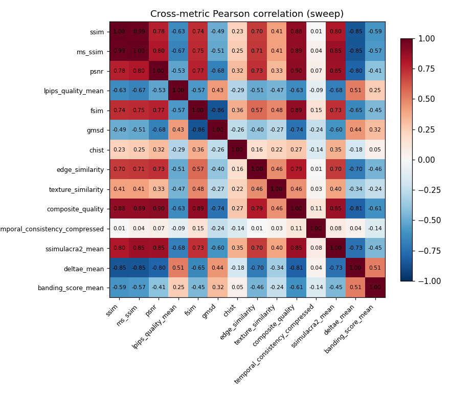

Metric pairs with |r| < 0.2 within the same family (e.g. SSIM vs MS-SSIM) suggest the metrics are measuring different things than expected.

### Distributions (key metrics)

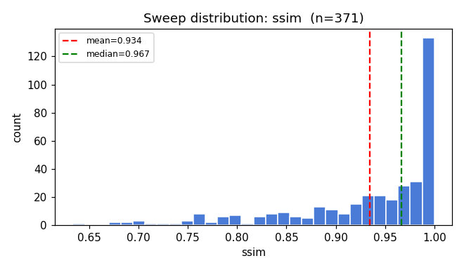

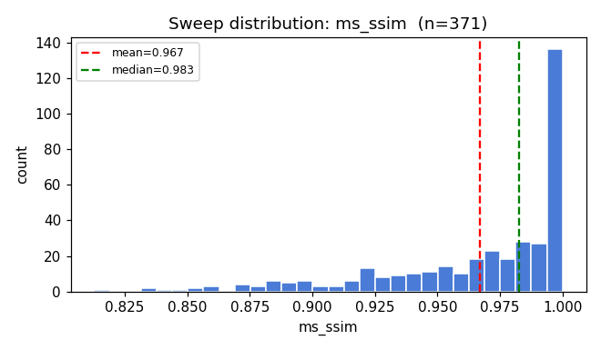

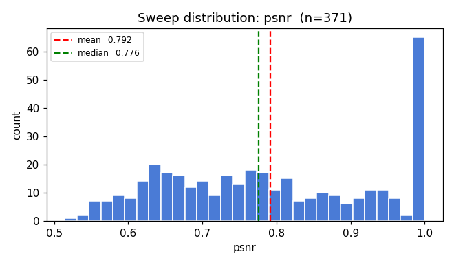

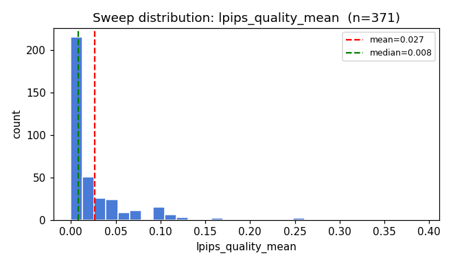

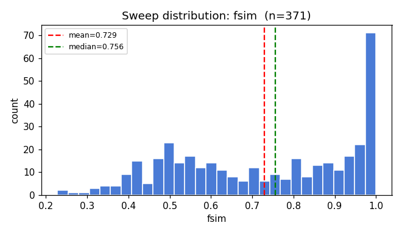

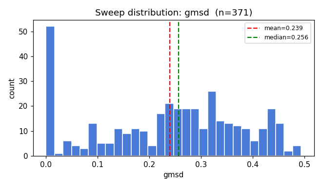

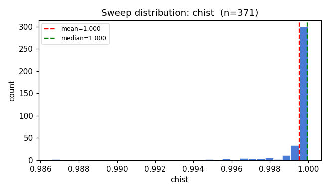

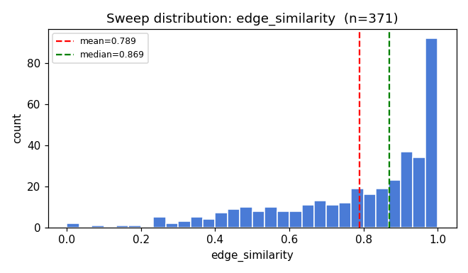

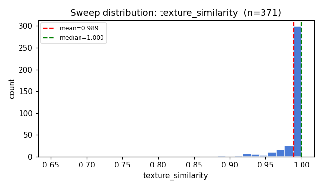

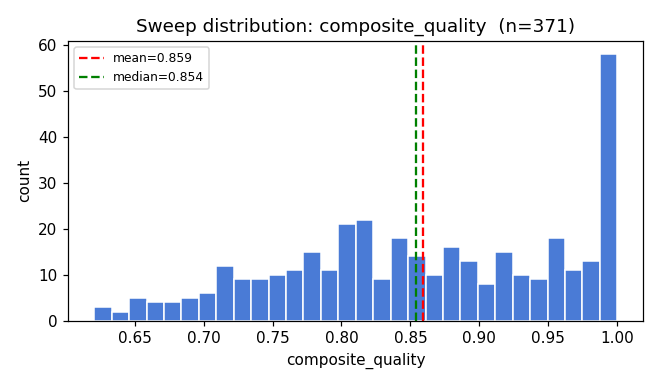

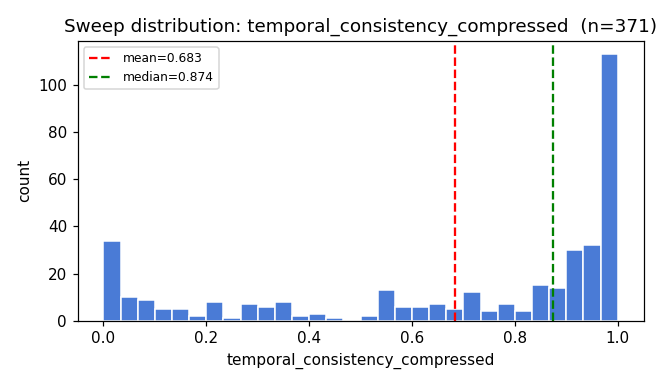

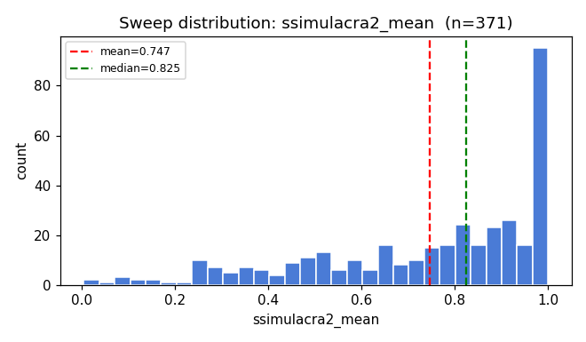

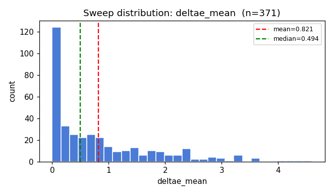

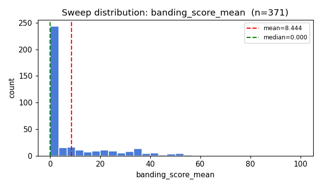

### Top outliers per metric (|z| highest)

#### ssim

| thumb | gif | lossy | source | content_type | value | z |
|---|---|---|---|---|---|---|
|  | https___d3k81ch9hvuctc.cloudfront.net_company_U8 | 60 | real |  | 0.6332 | -3.83 |
|  | https___image.e.lululemon.com_lib_fe351171716405 | 60 | real |  | 0.6731 | -3.33 |
|  | https___d3k81ch9hvuctc.cloudfront.net_company_PR | 60 | real |  | 0.6757 | -3.29 |
|  | https___d3k81ch9hvuctc.cloudfront.net_company_U8 | 60 | real |  | 0.6828 | -3.20 |
| 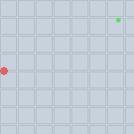 | static_minimal_change.gif | 60 | synthetic | static_plus | 0.6943 | -3.06 |

#### ms_ssim

| thumb | gif | lossy | source | content_type | value | z |
|---|---|---|---|---|---|---|
|  | https___d3k81ch9hvuctc.cloudfront.net_company_U8 | 60 | real |  | 0.8128 | -3.92 |
|  | static_minimal_change.gif | 60 | synthetic | static_plus | 0.8373 | -3.30 |
|  | https___image.e.lululemon.com_lib_fe351171716405 | 60 | real |  | 0.8376 | -3.29 |
|  | https___d3k81ch9hvuctc.cloudfront.net_company_U8 | 60 | real |  | 0.8389 | -3.26 |
|  | https___d3k81ch9hvuctc.cloudfront.net_company_PR | 60 | real |  | 0.8441 | -3.12 |

#### psnr

| thumb | gif | lossy | source | content_type | value | z |
|---|---|---|---|---|---|---|
|  | Superhuman 81246536.gif | 60 | real |  | 0.5144 | -1.97 |
|  | https___mcusercontent.com_52cce2d9ba60a58f04e3e1 | 60 | real |  | 0.5362 | -1.81 |
|  | noise_large.gif | 60 | synthetic | noise | 0.5382 | -1.80 |
|  | https___image.e.lululemon.com_lib_fe351171716405 | 60 | real |  | 0.5490 | -1.72 |
| 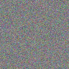 | photographic_noise.gif | 60 | synthetic | noise | 0.5505 | -1.71 |

#### lpips_quality_mean

| thumb | gif | lossy | source | content_type | value | z |
|---|---|---|---|---|---|---|
|  | https___i1.cmail20.com_ei_j_05_42F_D59_091032_cs | 60 | real |  | 0.3921 | +7.58 |
|  | static_minimal_change.gif | 60 | synthetic | static_plus | 0.3719 | +7.17 |
|  | https___i1.cmail20.com_ei_j_05_42F_D59_091032_cs | 40 | real |  | 0.2697 | +5.04 |
|  | https___content.app-us1.com_cdn-cgi_image_width= | 60 | real |  | 0.2567 | +4.77 |
|  | gradient_large.gif | 60 | synthetic | gradient | 0.2540 | +4.72 |

#### fsim

| thumb | gif | lossy | source | content_type | value | z |
|---|---|---|---|---|---|---|
|  | gradient_large.gif | 60 | synthetic | gradient | 0.2279 | -2.30 |
|  | gradient_medium.gif | 60 | synthetic | gradient | 0.2395 | -2.25 |
|  | https___d3k81ch9hvuctc.cloudfront.net_company_X9 | 60 | real |  | 0.2629 | -2.14 |
|  | https___d3k81ch9hvuctc.cloudfront.net_company_X9 | 40 | real |  | 0.2877 | -2.02 |
|  | minimal_frames.gif | 60 | synthetic | gradient | 0.3110 | -1.92 |

#### gmsd

| thumb | gif | lossy | source | content_type | value | z |
|---|---|---|---|---|---|---|
| 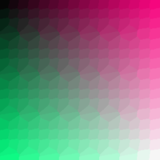 | gradient_xlarge.gif | 60 | synthetic | gradient | 0.4934 | +1.80 |
|  | https___userimg-assets.customeriomail.com_images | 40 | real |  | 0.4848 | +1.74 |
|  | static_minimal_change.gif | 60 | synthetic | static_plus | 0.4831 | +1.73 |
|  | gradient_large.gif | 40 | synthetic | gradient | 0.4815 | +1.72 |
| 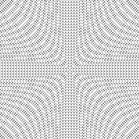 | high_frequency_detail.gif | 60 | synthetic | detail | 0.0000 | -1.70 |

#### chist

| thumb | gif | lossy | source | content_type | value | z |
|---|---|---|---|---|---|---|
|  | gradient_small.gif | 40 | synthetic | gradient | 0.9866 | -9.55 |
|  | gradient_small.gif | 60 | synthetic | gradient | 0.9866 | -9.51 |
|  | minimal_frames.gif | 60 | synthetic | gradient | 0.9924 | -5.26 |
|  | smooth_gradient.gif | 60 | synthetic | gradient | 0.9935 | -4.47 |
|  | gradient_medium.gif | 60 | synthetic | gradient | 0.9942 | -3.93 |

#### edge_similarity

| thumb | gif | lossy | source | content_type | value | z |
|---|---|---|---|---|---|---|
|  | gradient_medium.gif | 60 | synthetic | gradient | 0.0000 | -3.63 |
|  | gradient_medium.gif | 40 | synthetic | gradient | 0.0000 | -3.63 |
|  | https___mcusercontent.com_cdfc29de68ae93588ec6b0 | 60 | real |  | 0.0863 | -3.23 |
|  | https___mcusercontent.com_cdfc29de68ae93588ec6b0 | 40 | real |  | 0.1418 | -2.98 |
|  | https___mcusercontent.com_1baa1f1b305949ec908c25 | 60 | real |  | 0.1965 | -2.72 |

#### texture_similarity

| thumb | gif | lossy | source | content_type | value | z |
|---|---|---|---|---|---|---|
|  | https___mcusercontent.com_cdfc29de68ae93588ec6b0 | 60 | real |  | 0.6495 | -11.45 |
|  | https___mcusercontent.com_cdfc29de68ae93588ec6b0 | 40 | real |  | 0.7607 | -7.70 |
|  | https___i1.cmail20.com_ei_j_05_42F_D59_091032_cs | 60 | real |  | 0.8333 | -5.25 |
|  | https___i1.cmail20.com_ei_j_05_42F_D59_091032_cs | 40 | real |  | 0.8673 | -4.11 |
|  | texture_complex.gif | 60 | synthetic | texture | 0.8846 | -3.52 |

#### composite_quality

| thumb | gif | lossy | source | content_type | value | z |
|---|---|---|---|---|---|---|
|  | https___i1.cmail20.com_ei_j_05_42F_D59_091032_cs | 60 | real |  | 0.6207 | -2.33 |
|  | https___mcusercontent.com_cdfc29de68ae93588ec6b0 | 60 | real |  | 0.6237 | -2.30 |
|  | https___mcusercontent.com_1baa1f1b305949ec908c25 | 60 | real |  | 0.6323 | -2.21 |
|  | https___mcusercontent.com_5a6eda7241a0bb8bb0a2ab | 60 | real |  | 0.6376 | -2.16 |
|  | https___d3k81ch9hvuctc.cloudfront.net_company_U8 | 60 | real |  | 0.6405 | -2.13 |

#### temporal_consistency_compressed

| thumb | gif | lossy | source | content_type | value | z |
|---|---|---|---|---|---|---|
| .png) | https___mcusercontent.com_02daa6a2f0aa90cc9c88c6 | 40 | real |  | 0.0000 | -1.90 |
| .png) | https___mcusercontent.com_02daa6a2f0aa90cc9c88c6 | 20 | real |  | 0.0000 | -1.90 |
| .png) | https___mcusercontent.com_02daa6a2f0aa90cc9c88c6 | 60 | real |  | 0.0000 | -1.90 |
|  | https___d3k81ch9hvuctc.cloudfront.net_company_Vn | 20 | real |  | 0.0000 | -1.90 |
|  | https___d3k81ch9hvuctc.cloudfront.net_company_Vn | 40 | real |  | 0.0000 | -1.90 |

#### ssimulacra2_mean

| thumb | gif | lossy | source | content_type | value | z |
|---|---|---|---|---|---|---|
|  | unnamed copy 10.gif | 60 | real |  | 0.0040 | -2.97 |
|  | noise_small.gif | 60 | synthetic | noise | 0.0261 | -2.89 |
|  | unnamed copy 10.gif | 40 | real |  | 0.0520 | -2.78 |
|  | gradient_large.gif | 60 | synthetic | gradient | 0.0775 | -2.68 |
|  | gradient_xlarge.gif | 60 | synthetic | gradient | 0.1004 | -2.59 |

#### deltae_mean

| thumb | gif | lossy | source | content_type | value | z |
|---|---|---|---|---|---|---|
|  | https___mcusercontent.com_52cce2d9ba60a58f04e3e1 | 60 | real |  | 4.5927 | +3.97 |
|  | noise_large.gif | 60 | synthetic | noise | 4.4228 | +3.79 |
|  | https___image.e.lululemon.com_lib_fe351171716405 | 60 | real |  | 4.2782 | +3.64 |
|  | photographic_noise.gif | 60 | synthetic | noise | 4.1225 | +3.47 |
|  | https___d3k81ch9hvuctc.cloudfront.net_company_PR | 60 | real |  | 3.6090 | +2.93 |

#### banding_score_mean

| thumb | gif | lossy | source | content_type | value | z |
|---|---|---|---|---|---|---|
| .png) | https___mcusercontent.com_02daa6a2f0aa90cc9c88c6 | 60 | real |  | 100.0000 | +6.01 |
|  | https___d3k81ch9hvuctc.cloudfront.net_company_Vn | 60 | real |  | 74.8341 | +4.35 |
|  | https___d3k81ch9hvuctc.cloudfront.net_company_Vn | 40 | real |  | 68.7767 | +3.96 |
|  | https___mcusercontent.com_5a6eda7241a0bb8bb0a2ab | 60 | real |  | 56.9335 | +3.18 |
|  | https___mcusercontent.com_52cce2d9ba60a58f04e3e1 | 60 | real |  | 56.6249 | +3.16 |

### Cross-metric disagreement (top-spread GIFs)

GIFs where the best-ranked metric and the worst-ranked metric are far apart. Inspect these to see whether one of the metrics is mis-firing on this kind of content.

| thumb | gif | lossy | source | content_type | spread | best→ | worst→ |
|---|---|---|---|---|---|---|---|
|  | gradient_small.gif | 40 | synthetic | gradient | 1.00 | edge_similarity | chist |
|  | https___userimg-assets.customeriomail.com_images | 40 | real |  | 0.99 | banding_score_mean | gmsd |
|  | https___userimg-assets.customeriomail.com_images | 60 | real |  | 0.99 | banding_score_mean | gmsd |
|  | gradient_small.gif | 60 | synthetic | gradient | 0.98 | edge_similarity | chist |
|  | Superhuman 81246536.gif | 60 | real |  | 0.97 | banding_score_mean | psnr |
|  | https___userimg-assets.customeriomail.com_images | 20 | real |  | 0.97 | banding_score_mean | gmsd |
| .png) | https___mcusercontent.com_02daa6a2f0aa90cc9c88c6 | 40 | real |  | 0.97 | edge_similarity | temporal_consistency_compressed |
|  | minimal_frames.gif | 40 | synthetic | gradient | 0.96 | temporal_consistency_compressed | chist |
|  | https___d3k81ch9hvuctc.cloudfront.net_company_U8 | 60 | real |  | 0.96 | temporal_consistency_compressed | ssim |
|  | gradient_large.gif | 60 | synthetic | gradient | 0.96 | edge_similarity | fsim |

### Synthetic per-content-type means (key metrics)

| content_type | ssim | ms_ssim | psnr | lpips_quality_mean | fsim | gmsd | chist | edge_similarity | texture_similarity | composite_quality | temporal_consistency_compressed | ssimulacra2_mean | deltae_mean | banding_score_mean |
|---|---|---|---|---|---|---|---|---|---|---|---|---|---|---|
| charts | 1.000 | 1.000 | 1.000 | 0.000 | 1.000 | 0.000 | 1.000 | 1.000 | 1.000 | 1.000 | 0.997 | 1.000 | 0.000 | 0.000 |
| complex_gradient | 0.933 | 0.968 | 0.736 | 0.009 | 0.592 | 0.375 | 0.998 | 0.594 | 0.993 | 0.834 | 1.000 | 0.767 | 0.778 | 0.000 |
| contrast | 1.000 | 1.000 | 1.000 | 0.000 | 1.000 | 0.000 | 1.000 | 1.000 | 1.000 | 1.000 | 1.000 | 1.000 | 0.000 | 0.000 |
| detail | 1.000 | 1.000 | 1.000 | 0.000 | 1.000 | 0.000 | 1.000 | 1.000 | 1.000 | 1.000 | 1.000 | 1.000 | 0.000 | 0.000 |
| geometric | 1.000 | 1.000 | 1.000 | 0.000 | 1.000 | 0.000 | 1.000 | 1.000 | 1.000 | 1.000 | 1.000 | 1.000 | 0.000 | 0.000 |
| gradient | 0.930 | 0.962 | 0.757 | 0.048 | 0.596 | 0.331 | 0.996 | 0.859 | 0.984 | 0.844 | 0.951 | 0.619 | 0.784 | 0.000 |
| micro_detail | 0.998 | 0.999 | 0.863 | 0.009 | 0.997 | 0.048 | 1.000 | 0.241 | 1.000 | 0.875 | 0.629 | 0.932 | 0.023 | 0.000 |
| minimal | 1.000 | 1.000 | 1.000 | 0.000 | 1.000 | 0.000 | 1.000 | 1.000 | 1.000 | 1.000 | 1.000 | 1.000 | 0.000 | 0.000 |
| mixed | 1.000 | 1.000 | 1.000 | 0.000 | 0.983 | 0.008 | 1.000 | 1.000 | 1.000 | 0.998 | 0.945 | 1.000 | 0.004 | 0.000 |
| morph | 1.000 | 1.000 | 1.000 | 0.000 | 1.000 | 0.000 | 1.000 | 1.000 | 1.000 | 1.000 | 0.841 | 1.000 | 0.000 | 0.000 |
| motion | 1.000 | 1.000 | 1.000 | 0.000 | 1.000 | 0.000 | 1.000 | 1.000 | 1.000 | 1.000 | 0.918 | 1.000 | 0.000 | 0.000 |
| noise | 0.965 | 0.975 | 0.681 | 0.014 | 0.882 | 0.085 | 1.000 | 0.716 | 1.000 | 0.885 | 0.972 | 0.588 | 1.458 | 0.000 |
| solid | 1.000 | 1.000 | 1.000 | 0.000 | 1.000 | 0.000 | 1.000 | 1.000 | 1.000 | 1.000 | 1.000 | 1.000 | 0.000 | 0.000 |
| spectrum | 0.930 | 0.968 | 0.752 | 0.009 | 0.715 | 0.315 | 1.000 | 0.676 | 0.997 | 0.863 | 1.000 | 0.784 | 0.672 | 0.000 |
| static_plus | 0.898 | 0.946 | 0.873 | 0.124 | 0.834 | 0.161 | 1.000 | 0.970 | 0.994 | 0.910 | 0.708 | 0.779 | 0.227 | 0.000 |
| texture | 0.908 | 0.957 | 0.700 | 0.053 | 0.519 | 0.266 | 0.999 | 0.640 | 0.930 | 0.813 | 1.000 | 0.755 | 1.612 | 0.000 |

---

Generated by `scripts/audit/report.py`. Source CSVs: `report.py` arguments. Re-run any of the audit scripts to refresh.