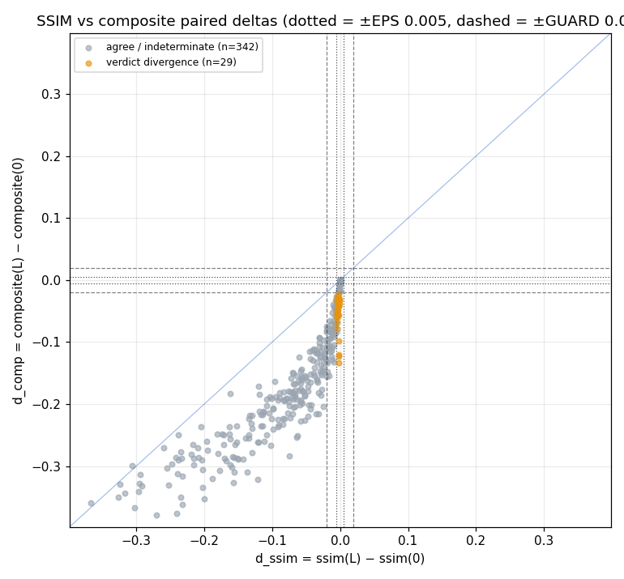
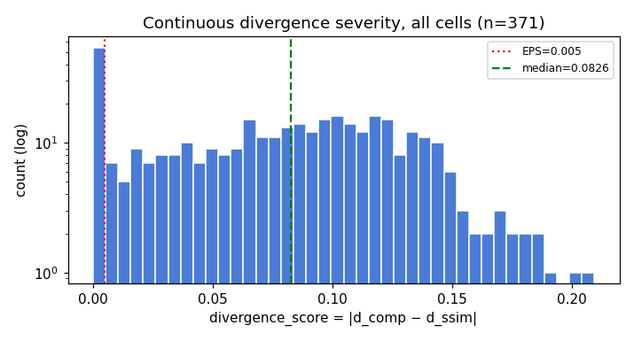
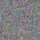
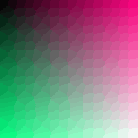

# SSIM vs composite_quality divergence

Control-relative paired-delta audit: each GIF's `lossy=0` row (animately recompress, no lossy) is its own control; per cell `d_ssim = ssim(L) − ssim(0)` and `d_comp = composite_quality(L) − composite_quality(0)`. **EPS = 0.005** (identical to gifprep's `EPSILON_QUALITY` verdict gate, so findings transfer 1:1 downstream), **GUARD = 0.02** (4×EPS). *Direction divergence*: deltas point in opposite directions, both beyond EPS. *Verdict divergence*: one metric held (|d| ≤ EPS) while the other moved beyond GUARD. The zone between EPS and GUARD is a deliberate indeterminate band — never flagged. `divergence_score = |d_comp − d_ssim|` is computed for every analysable cell (continuous severity; cannot tie-saturate). Cells with NaN in either metric in either row are excluded and counted, never imputed. Run provenance: `data/sweep_run.log`.

## Summary

- Analysable cells: **371** (GIFs with usable control: 125)
- Direction-divergent: **0**
- Verdict-divergent (held-vs-degraded): **29**
- Same direction beyond EPS: 274
- Both held (|d| ≤ EPS): 52
- Indeterminate (sub-GUARD movement): 16
- Unanalysable cells (excluded, never imputed): 0 — no control: 0, NaN control: 0, NaN cell: 0

### Sensitivity (EPS × {0.5, 1, 2}, GUARD = 4×EPS)

| eps | guard | direction | verdict | agreement rate |
|---|---|---|---|---|
| 0.0025 | 0.0100 | 0 | 23 | 93.8% |
| 0.0050 | 0.0200 | 0 | 29 | 92.2% |
| 0.0100 | 0.0400 | 0 | 41 | 88.9% |

## Flagged cells (ranked by divergence_score)

Per-cell attribution decomposes the composite movement into its 15 named contributor terms `w_i·(norm_i(L) − norm_i(0))`; contributors missing in exactly one row are listed as redistribution drivers. Every attribution is round-trip verified against the production `calculate_composite_quality` — mismatches are marked NON-ATTRIBUTABLE, never silently trusted. `frame_class` annotates frame-reduction: `frame_loss` cells carry an alignment caveat (frame misalignment can move SSIM and temporal-delta differently — treat the deltas with suspicion).

| thumb | gif | lossy | source | content_type | frame_class | d_ssim | d_comp | score | flag | top composite drivers |
|---|---|---|---|---|---|---|---|---|---|---|
|  | single_pixel_anim.gif | 60 | synthetic | micro_detail | none | -0.0022 | -0.1333 | 0.1311 | verdict | edge_similarity_mean -0.0455; temporal_consistency_delta -0.0398; mse_mean -0.0181 |
|  | single_pixel_anim.gif | 40 | synthetic | micro_detail | none | -0.0022 | -0.1230 | 0.1207 | verdict | edge_similarity_mean -0.0455; temporal_consistency_delta -0.0370; mse_mean -0.0181 |
|  | single_pixel_anim.gif | 20 | synthetic | micro_detail | none | -0.0022 | -0.1198 | 0.1176 | verdict | edge_similarity_mean -0.0455; temporal_consistency_delta -0.0337; mse_mean -0.0182 |
|  | gradient_xlarge.gif | 20 | synthetic | gradient | none | -0.0021 | -0.0987 | 0.0966 | verdict | edge_similarity_mean -0.0600; gmsd_mean -0.0123; mse_mean -0.0121 |
|  | https___media.wordfly.com_malthousetheatre_email | 60 | real |  | none | -0.0046 | -0.0781 | 0.0735 | verdict | mse_mean -0.0215; gmsd_mean -0.0189; psnr_mean -0.0147 |
|  | http___i3.cmail19.com_ei_i_BB_5DC_A14_csimport_T | 40 | real |  | none | -0.0045 | -0.0686 | 0.0641 | verdict | mse_mean -0.0197; gmsd_mean -0.0190; psnr_mean -0.0133 |
|  | http___i6.cmail19.com_ei_i_BB_5DC_A14_csimport_T | 40 | real |  | none | -0.0044 | -0.0600 | 0.0557 | verdict | mse_mean -0.0196; gmsd_mean -0.0170; psnr_mean -0.0128 |
|  | https___media.wordfly.com_malthousetheatre_email | 40 | real |  | none | -0.0023 | -0.0563 | 0.0539 | verdict | gmsd_mean -0.0179; mse_mean -0.0141; psnr_mean -0.0087 |
|  | unnamed copy 2.gif | 60 | real |  | none | -0.0046 | -0.0576 | 0.0530 | verdict | mse_mean -0.0251; psnr_mean -0.0130; gmsd_mean -0.0072 |
|  | https___media.wordfly.com_wheelercentre_emails_2 | 40 | real |  | none | -0.0037 | -0.0561 | 0.0524 | verdict | mse_mean -0.0177; edge_similarity_mean -0.0117; gmsd_mean -0.0091 |
|  | noise_large.gif | 20 | synthetic | noise | none | -0.0049 | -0.0539 | 0.0490 | verdict | mse_mean -0.0220; psnr_mean -0.0149; edge_similarity_mean -0.0059 |
|  | https___media.wordfly.com_melbournetheatre_email | 60 | real |  | none | -0.0048 | -0.0497 | 0.0449 | verdict | mse_mean -0.0166; gmsd_mean -0.0111; psnr_mean -0.0107 |
|  | unnamed copy 2.gif | 40 | real |  | none | -0.0038 | -0.0485 | 0.0448 | verdict | mse_mean -0.0240; gmsd_mean -0.0072; psnr_mean -0.0070 |
|  | https___i1.cmail20.com_ei_i_B2_30B_6B5_csimport_ | 20 | real |  | none | -0.0041 | -0.0481 | 0.0440 | verdict | gmsd_mean -0.0254; fsim_mean -0.0108; psnr_mean -0.0043 |
|  | gradient_large.gif | 20 | synthetic | gradient | none | -0.0026 | -0.0421 | 0.0395 | verdict | mse_mean -0.0150; gmsd_mean -0.0131; sharpness_similarity_mean -0.0038 |
|  | http___i3.cmail19.com_ei_i_BB_5DC_A14_csimport_T | 20 | real |  | none | -0.0025 | -0.0416 | 0.0392 | verdict | gmsd_mean -0.0190; fsim_mean -0.0070; mse_mean -0.0065 |
|  | https___d3k81ch9hvuctc.cloudfront.net_company_SP | 40 | real |  | none | -0.0029 | -0.0417 | 0.0388 | verdict | edge_similarity_mean -0.0133; gmsd_mean -0.0119; sharpness_similarity_mean -0.0112 |
|  | unnamed copy 2.gif | 20 | real |  | none | -0.0034 | -0.0408 | 0.0374 | verdict | mse_mean -0.0236; gmsd_mean -0.0074; ssimulacra2_mean -0.0052 |
|  | https___d3k81ch9hvuctc.cloudfront.net_company_Xu | 60 | real |  | none | -0.0012 | -0.0381 | 0.0369 | verdict | mse_mean -0.0138; psnr_mean -0.0091; gmsd_mean -0.0074 |
|  | http___i4.cmail19.com_ei_i_3A_905_41B_csimport_Q | 20 | real |  | none | -0.0012 | -0.0331 | 0.0319 | verdict | gmsd_mean -0.0157; mse_mean -0.0054; psnr_mean -0.0047 |
|  | https___hs-8497520.f.hubspotemail.net_hub_849752 | 60 | real |  | none | -0.0016 | -0.0319 | 0.0304 | verdict | mse_mean -0.0099; gmsd_mean -0.0078; psnr_mean -0.0068 |
|  | 64e84ea7006ccc7100a67c78_Property 1=SUN_SPIKEY_W | 20 | real |  | none | -0.0022 | -0.0322 | 0.0300 | verdict | mse_mean -0.0091; gmsd_mean -0.0067; psnr_mean -0.0065 |
|  | 64e57f8915d0d761adf6173c_gif_ALIEN_BOOGIE_WEB 1- | 20 | real |  | none | -0.0008 | -0.0305 | 0.0297 | verdict | mse_mean -0.0087; gmsd_mean -0.0068; psnr_mean -0.0063 |
|  | https___media.wordfly.com_melbournetheatre_email | 40 | real |  | none | -0.0039 | -0.0327 | 0.0288 | verdict | gmsd_mean -0.0108; mse_mean -0.0081; psnr_mean -0.0059 |
|  | https___media.giphy.com_media_v1.Y2lkPTc5MGI3NjE | 40 | real |  | none | -0.0039 | -0.0321 | 0.0282 | verdict | gmsd_mean -0.0142; mse_mean -0.0046; fsim_mean -0.0037 |
|  | rcs-evolution.gif | 20 | real |  | none | -0.0049 | -0.0331 | 0.0282 | verdict | gmsd_mean -0.0150; fsim_mean -0.0056; mse_mean -0.0046 |
|  | noise_small.gif | 20 | synthetic | noise | none | -0.0017 | -0.0298 | 0.0282 | verdict | mse_mean -0.0129; psnr_mean -0.0083; edge_similarity_mean -0.0039 |
|  | http___i1.cmail19.com_ei_i_5D_3B8_4C0_csimport_2 | 20 | real |  | none | -0.0020 | -0.0232 | 0.0212 | verdict | gmsd_mean -0.0082; edge_similarity_mean -0.0047; psnr_mean -0.0040 |
|  | gradient_medium.gif | 20 | synthetic | gradient | none | -0.0048 | -0.0257 | 0.0209 | verdict | gmsd_mean -0.0143; fsim_mean -0.0039; sharpness_similarity_mean -0.0021 |

## Adjacent-level monotonicity disagreement

sign(Δssim) vs sign(Δcomposite) over consecutive lossy levels — catches "composite recovers while SSIM keeps falling" shapes that the control-relative deltas can smooth over.

No adjacent-level sign disagreement beyond EPS=0.005 across 371 steps.

## Identity-relative divergence at the control point

Both metrics have identity value exactly 1.0 (sanity.json), so comparing `1 − ssim(0)` vs `1 − composite(0)` exposes palette-axis divergence (lossy=0 still palette-quantises) that the lossy-delta framing hides. `identity_gap = composite(0) − ssim(0)`; large |gap| means the two metrics already disagree about the palette/recompress step.

| gif | source | content_type | ssim(0) | composite(0) | identity_gap |
|---|---|---|---|---|---|
| https___media.wordfly.com_malthousetheatre_email | real |  | 1.0000 | 1.0000 | +0.0000 |
| https___media.wordfly.com_malthousetheatre_email | real |  | 1.0000 | 1.0000 | +0.0000 |
| https___i7.cmail19.com_ei_i_B1_12F_BDC_csimport_ | real |  | 1.0000 | 1.0000 | +0.0000 |
| https___i5.cmail20.com_ei_i_9B_2EB_550_csimport_ | real |  | 1.0000 | 1.0000 | +0.0000 |
| https___i5.cmail19.com_ei_i_F9_E01_E30_csimport_ | real |  | 1.0000 | 1.0000 | +0.0000 |
| https___s.zkcdn.net_Advertisers_59a54d018e674afe | real |  | 1.0000 | 1.0000 | +0.0000 |
| https___mcusercontent.com_53222dcf7155dec475bbb4 | real |  | 1.0000 | 1.0000 | +0.0000 |
| https___i1.cmail20.com_ei_i_B2_30B_6B5_csimport_ | real |  | 1.0000 | 1.0000 | +0.0000 |
| https___i1.cmail19.com_ei_i_49_578_A4D_csimport_ | real |  | 1.0000 | 1.0000 | +0.0000 |
| https___cdn2.allevents.in_transup_43_f3dbb640874 | real |  | 1.0000 | 1.0000 | +0.0000 |

---

Generated by `scripts/audit/report.py` (divergence pass). Per-cell deltas: `data/divergence_cells.csv`.